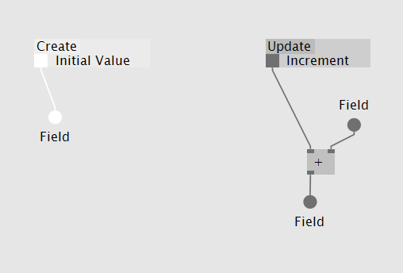

# The running System

This may sound like cheating, but think of the whole running system as a process node. It gets created once and then updated repeatedly.

#### A Root Patch

The root patch defines the process.

*vvvv user: When cloning a VL template from within vvvv you create a new root patch. The vvvv node contains and manages one instance of the process you just created.*

#### Create And Update

Within the root patch you define what's happening for when the system starts and when the system runs. For that you may place nodes onto "Create" and onto "Update". 

As we are still looking at things: 

Again: a part of the patch is only executed once when the system starts. The other part is then called over and over again. Can you tell which is which?

*vvvv user: when creating or resetting the node from within vvvv the process gets reset: "Create" is called. From then on "Update" is called each vvvv frame.*

#### Persistency
The root patch as already stated is like a process node. It sticks around and may evolve. It may store data internally and retrieve it next frame. 