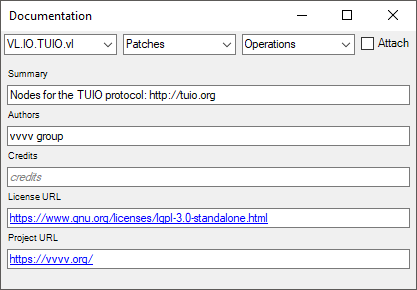

:experimental:
= Documentation Window

Using the documentation window you can add documentation to all your elements. Press kbd:[Ctrl + M] to open it and then use the 3 pulldowns on top to navigate:

* Documents
* Patches in the selected document
* Operations in the selected patch

As long as the _Attach_ checkbox is not activated navigating between the patchs in the editor lets the documentation window follow the active patch. 

Specifying documentation is mostly useful when preparing libraries that you want to share with others. When working on documents for your own projects you'll hardly ever use it. 

== Document
* Summary: One sentence description of the content of the document
* Authors
* Credits
* License URL
* Project URL

== Datatype
* Summary: One sentence description of the datatype
* Remarks: Additional usage info, warnings, bugs,...
* Tags: a comma-separated list of tags to find the datatype in the NodeBrowser
* Properties: description of each individual property of the datatype

== Operation
* Summary: One sentence description of the operation
* Remarks: Additional usage info, warnings, bugs,...
* Tags: a comma-separated list of tags to find the operation in the NodeBrowser
* Inputs: description of each individual input of the operation
* Outputs: description of each individual output of the operation
