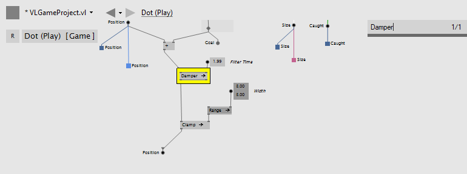

= Finders
:experimental:
:figure-caption!:

The development environment offers 3 different ways to find stuff quickly

- Finder: looks for strings in the active patch
- SymbolFinder: looks for documents, patches, operations, pads
- Show All References: show all applications of a definition

== Finder
Press kbd:[Ctrl + F] in any patch to search for local occurrences of strings. Type a string and then use kbd:[F3] or kbd:[Enter] to navigate through the results. Press kbd:[ESC] to hide the results again.

.Finder

== SymbolFinder
Press kbd:[Ctrl + Shift + F] to globally search for any symbol including the given string.

.Symbol Finder
image::vl-graybook-Finder-SymbolFinder.png[Symbol Finder]

Use the shortcuts below followed by a " " (space) to narrow down your search:
[cols="1,5", options="header"]
|===
|Shortcut
|Description

|d
|Search for documents only

|p
|Search for patches (types, processes) only

|m
|Search for member operations only

|u
|Search for utility operations only

|f
|Search for fields only
|===

== Show All References
still to come
