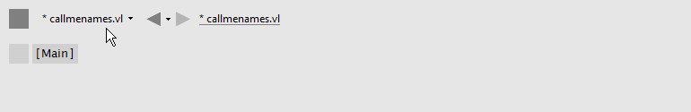

= Navigating a Project

A project in VL typically consists of a single .vl document that holds one ore more patches. In addition a document can depend on other documents or Nugets whose nodes it can access.

In the main menubar you always see the filename of the document you're currently working on, ie. the "Active Document". 

.The main menubar with the Active Document "callmenames.vl"
[caption=""]

== Active Document Menu
Clicking on the active document opens its menu. At the bottom of the menu you see the VL version the document was last saved with. If there is a little green or red icon before the document name, this means that the document has been saved with a version different to the one currently running. :

.In this example VL version 56 is running
[caption=""]
image::/images/vl-ActiveDocument-UpgradeOrNewerVersion.png[]

*Green*

A little green symbol next to the document's name is a hint that the document was upgraded to the currently running version, which is usually just fine. Still this hint is given so you know that if you save the document in this version it may have troubles being loaded in an older version.

*Red*

A red symbol is a warning that the document was last saved with a newer version and therefore things may not look/work as expected. In that case consider running a newer version of VL to open this document.

=== Dependencies
A document can reference two different types of dependencies:

* Nugets
* Files

.Document's dependencies
[caption=""]
image::/images/vl-Dependencies.png[]

==== Nugets
Navigate to Nugets to see a list of all available nugets. Each nuget is a collection of documents (.vl, .dll,..) that provide nodes for a document. A version in brackets next to a nuget means that the currently loaded version of the nuget is different to the version that was originally referenced. > meaning the referenced version being smaller, < meaning the referenced version being bigger than the currently loaded version.

.Available Nugets
[caption=""]
image::/images/vl-Dependencies-Nuget.png[]

Rightclick a nuget to select it. Selected nugets provide access to all their nodes via the nodebrowser in that document. 

In the "Other" section you find all nugets that are not relevant for VL in that they don't expose nodes. Selecting them does not do anything to your document for now. 

==== Files
In addition to nugets you can also reference individual files of the following types:

* .vl
* .dll

.Add Files
[caption=""]
image::/images/vl-Dependencies-File.png[]

Choose "Add Existing..." to select a file via the file browser. All nodes that are exposed by those files will be available in your active document via the nodebrowser.

==== Forward
In this section you see a listing of all nugets and files combined. Here you can specify if the nodes of a specific dependency will be forwarded or not.

By default if you add a dependency to a document you get only the nodes the dependency exposes directly. Dependencies can depend on other dependencies which you don't see by default. 

Only if you check a dependency as "Forward" it will also be seen by documents that only include their parent document. 