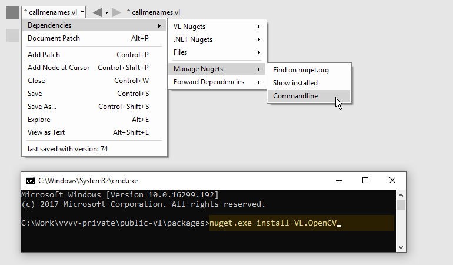
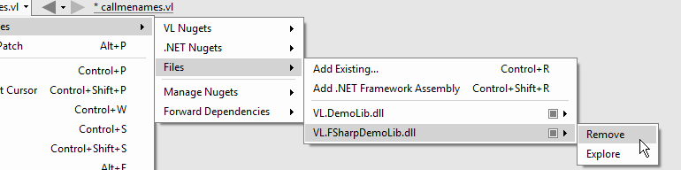

:experimental:
:figure-caption!:

= Dependencies

VL Documents can reference 3 different types of dependencies:

* VL Nugets
* .NET Nugets
* Files

When a document references a dependency, it means that all public nodes in that dependency will be available in the nodebrowser of the referencing document. 

== Nugets
link:https://www.nuget.org/[NuGet] is the package managing system for .NET. Nugets are packages that can contain many .dll and/or .vl files that expose nodes to the referencing document.

=== VL vs. .NET Nugets
A VL Nuget is a nuget specifically created for use with vl that won't work for any other link:https://en.wikipedia.org/wiki/List_of_CLI_languages[.NET language]. It is still a valid nuget in the original terms of NuGet but since it contains .vl documents it will not be useable outside of vl. 

A .NET Nuget on the other hand is more generally targetting any .NET language.

You can reference either VL or .NET nugets via the menu by navigating to it and pressing the right mousebutton to toggle its selection:

.Rightclick toggles adding/removing a nuget reference.
image::../../images/vl-Dependencies-Nuget.png[]

=== Manage Nugets

- *Find on nuget.org* opens a webbrowser and lets you search for nugets in the online repository. Note that for now, after you've found what you're looking for, you'll still have to install a nuget manually via the commandline
- *Show installed* opens a file explorer at the path all your nugets are installed locally
- *Commandline* Opens a commandline from which you can run link:https://docs.microsoft.com/en-us/nuget/tools/nuget-exe-cli-reference[nuget commands] like "install"

.Installing a nuget via the commandline.

NOTE: After installing a nuget via the commandline it is not yet automatically referenced by the current document! It is now merely available among the Nugets via the Dependencies menu from where it can be added as a reference as shown above.

NOTE: To update to the latest version of a nuget you have already installed, simply run the install command again. Your package directory can contain multiple versions of the same nuget and vl will always use the newest. Older versions have to be removed manually if no longer needed.

=== Missing Nugets
If a nuget that is referenced by a document cannot be found,  it will be listed in red in the Dependencies menu. In such a case a rightclick on a red entry allows you to:

- *Install*: attempt to install from nuget.org. This will obviously only work if the nuget can be found online
- *Remove Reference*: remove this nuget as a dependency of this document

Note that you can rightlclick to select multiple red entries and then choose to apply either install or remove to all of them at once.

.Missing nuget options.
image::../../images/vl-Dependencies-MissingNuget.png[]

=== Unmanaged/Native dependencies
Some nugets are shipping with or depending on unmanaged/native .dlls which cannot be picked up by vl automatically since there isn't a pattern in the nuget specification as to how those should be handled. So in order to get such unmanaged dependencies of a nuget picked up, for now you'll have to add a search-path for vl via a batch file, like so:

----
SET PATH=%PATH%;c:\path\to\nugets\nativelibs
----

== Files
A vl document can reference other .vl documents and managed .dll files. 

=== From Disk
Here are 3 ways to reference local files:

* Drop a .vl or .dll file onto a patch 
* Press kbd:[Ctrl + R] to select files via a file browser
* Via menu:Document[Dependencies > Files > Add Existing...]

.Add existing File as dependency.
image::../../images/vl-Dependencies-File.png[]

==== Missing Files
Files that are showing up in red cannot be found on disk. You can Rightlcick to remove their reference. Note that you can also rightclick to select multiple files in a row and then apply "Remove" to all of them at once.
 
.Remove files.

=== Libraries from the GAC (Global Assembly Cache)

By default .NET comes with a large number of assemblies that can be referenced. They are stored in the link:https://docs.microsoft.com/en-us/dotnet/framework/app-domains/gac[GAC] on all machines that have .NET installed and can be referenced from there via:

* Press kbd:[Ctrl + Shift + R]
* via menu:Document[Dependencies > Files > Add .NET Framework Assembly...]

In the dialog you need to double-click entries that you want to add as references.

.Use kbd:[Ctrl + F] in this window to find libraries in the GAC.
image::../../images/vl-libraries-using-GACWindow.png[]

