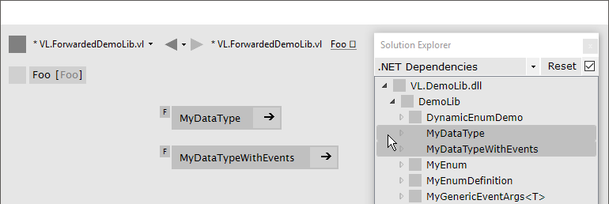
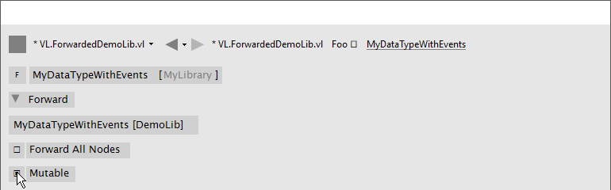
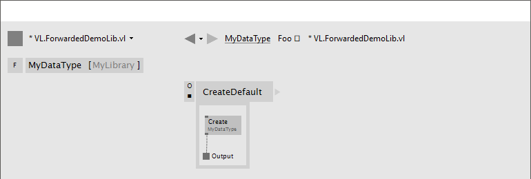
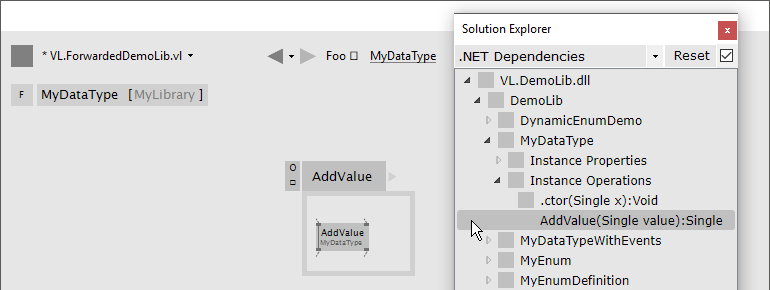
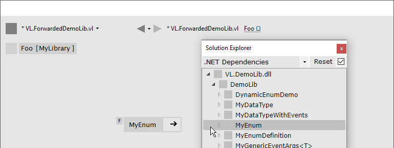

:experimental:
:figure-caption!:

= Forwarding .NET Libraries

By link:/reference/libraries/using_net_libraries.adoc[Using .NET Libraries] we have direct access to a vast range of nodes for patching in VL. Many of those libraries though will not be very convenient to use in the dataflow context of VL. 

To make those libraries accessible to more casual users we often want to curate exactly what nodes and types of the original library are seen by them. Forwarding allows us to insert a very thin wrapper layer to conveniently provide such curation.

== Reasons to Forward
- Selectively forward types and operations of .NET .dlls
- Adjust VL relevant meta information on the types (like mutability and known type structure)
- Choose a relevant category for the nodes and types in VL
- Do simple unit or type conversions (e.g. from angles in radians to angles in cycles)
- Rename pins, operations, types
- Set default values for input pins
- Provide convenience process nodes that wrap some low-level functionality into more high-level nodes
- Design lifetime management of disposable objects

[NOTE]
====
An important aspect when forwarding types from a library is that we don't want to introduce new wrapper-types. Therefore using Forwarding does not introduce new types! 

Forwarded types are compatible to the original library in order to allow users to fall back to low-level functionality of the original library and combine that with the use of the higher-level wrapper. 

Also, the wrapper can act as a useful layer to shield the end-user of a vl-library from changes in the original library. Instead of confronting a vl-user directly with the (e.g. naming) changes of an original library, forwards allow us to implement ways to not break patches in such cases. 
====

== Forwarding Types
In a typical scenario you create _one .vl document_ to forward types from one or more .NET .dlls. This .vl document is then the only thing a user of your library will have to reference.

=== Create Type Forward

==== 1. Set a reference to the .NET .dll
In a blank .vl document set a reference to the .NET .dll(s) you want to forward types from. See link:/reference/libraries/dependencies.adoc[Dependencies].

==== 2. Prepare a Category Group
An imported type will show-up in the category defined by the group you place it in. So, create groups for every category of your library in the Document Patch.

.Groups (representing categories) in a document's main patch.
image::../../images/vl-libraries-wrapping-CategoryGroups.png[]

NOTE: Empty categories are not showing-up in the NodeBrowser.

==== 3. Create Type Forward
There are two ways to create a type forward:

===== Drag-Drop from the Solution Explorer

. Open the group you want to drop the type into
. Open the Solution Explorer
. Choose '.NET Dependencies'
. Find the type you want to forward
. Drag-Drop the type into the group

.Drag-Drop type from Solution Explorer into group.


===== Manually

. Open the group you want to drop the type into
. Create a new _Process_ patch
. Set the `patch type` to 'Forward'
. Set a `type-annotation` on the patch

.Left: Click the `patch type` drop-down and set 'Forward'. Right: Click the `type-annotation` and choose a type from the NodeBrowser.
image::../../images/vl-libraries-wrapping-Manually.png[]

=== Configure Type Forward
==== Rename Type
Typically you may want to keep the name of a type from the original library. If you have a good reason to rename it, simply do so.

.Renaming a Type.
image::../../images/vl-libraries-wrapping-Rename.png[]

==== Forward All Nodes
When you create a type forward, every operation of the type is forwarded as a node by default. If you prefer to selectively forward only a subset of a types' operations, uncheck the 'Forward All Nodes' option.

.Forward All Nodes.
image::../../images/vl-libraries-wrapping-ForwardAll.png[]
 
NOTE: Even if the option is activated you can still adjust the forwarding of individual operations by simply creating an operation forward for them, see below.

==== Mutability
+++.NET Libraries+++ don't come with meta information of whether a type is mutable or not. Because of this we need to tell VL manually by setting the mutable flag accordingly.

.Mutable checkbox.


Since most .NET types are mutable, this flag is activated by default. Here is how to detect whether a .NET type is immutable:

* It only has readonly fields
* Each of its fields is of an immutable type
* Optional: it has `WithFoo(TFoo newValue)` methods to get a new instance (= a new immutable snapshot) of that type, where all fields are set to the values as in this instance, but only the field `Foo` is set to the `newValue`.

In an upcoming version of C# watch out for 'Records'. They should ease the pain for writing immutable types.

==== Known Type Structure
TODO

*Image: Known Type Structure*

==== Create Default
Member operation nodes often expect a type on their main input and throw a 'Null Pointer Exception' as long as nothing is connected to it. In order to prevent this, we need to tell vl how it can construct a default instance of a type whenever needed. 

To do so, simply create an operation called `CreateDefault` in a type forward patch and implement it so that it returns an instance of the type. Often this requires nothing more than returning the result of a constructor of the type.

.Creating a Default for a type.


==== Process Node
Each type forward can also directly expose a process node. This is exactly the same as exposing a process node from an ordinary patch. See..

If you want to expose more than one process node from a single type forward, you have to create an extra patch for each additional process node that does not forward the type but simply uses the types operations to create the desired process.

== Forwarding Operations

As shown above, a type forward can easily forward all of its operations automatically. Even with "Forward All Nodes" activated though, it can make sense to manually forward some operations to tweak some settings. 

To create forwards for individual operations:

. Open the type you want to drop the operation into
. Open the Solution Explorer
. Choose '.NET Dependencies'
. Find the operation you want to import
. Drag-Drop the operation into the type

.Dropping the operation into type.


NOTE: You can also select multiple operations and drop those into the patch at once. 

You now have a forwarding operation definition wrapped around the node you want to forward. All pins of the forwarded node are  automatically reflected in the signature of the forwarding definition.  That also means that any change to the signature of the node (ie. pin added/renamed/removed in its underlying .NET code) will also be automatically reflected in the forwarding definitions signature. If for some reason this behavior is not desired, see "Manually managing the Signature" below.

Still you can apply the following modifications to a forward without manually managing its signature:

=== Renaming a Pin
If you have a good reason to change the name of a pin, e.g. in order to have it conform to the link:/reference/vl/namings.adoc[vl naming conventions], then do so by manually creating an input or output for a particular pin and renaming it.

.Renaming a Pin.
image::../../images/vl-libraries-wrapping-ForwardPins-Rename.png[]

=== Setting a Default
Parameters of operations rarely have meaningful defaults. In order to forward a pin with a proper default, manually create an input for a particular pin and set a default for it. 

.Setting a default on an input via Middleclick or menu:Rightclick[Configure].


=== Hiding a Pin
Even if the automatic forwarding of all pins is on, you can override forwarding of individual pins by simply connecting an IOBox to them. 

.Hiding a Pin.


=== Type or Unit Conversions
Forwards are a good place to do simple type or unit conversions. Consider an operation that takes angles in radians, but you want to use vl-conform cycles.

.SineWave takes an angle in cycles.
image::../../images/vl-libraries-wrapping-ForwardPins-Conversion.png[]

=== Show Category
By default member operations have this activated while static operations don't. The only reason to change this default should be nodes like the Vector (Join) where the fact that they are members is not relevant to the readability of a patch. Compare the following:

.Vector (Join) [2D.Vector2] does not show its category, while GetSlice [Collections.Spreads] does.
image::../../images/vl-libraries-wrapping-ShowCategory-Compare.png[]

Rightclick on the header of the operation you're forwarding and choose menu:Configure[Show Category] to specify whether or not a node shows its type category. 

.Show Category checkbox
image::../../images/vl-libraries-wrapping-ShowCategory.png[]

== Manually managing the Signature
When forwarding a node, you'll usually want to automatically sync its signature to the one of its surrounding definition. This is why by default the two options which manage this behavior are on:

- Automatic Signature
- Connect to Signature

A reason to disable these would be if you want to create a stable API for a vl library that you don't want to be automatically adapting to changes in the underlying .NET library. Since a change in the .NET library may cause an incompatibility for users of your vl library you'll want to have the chance to review such changes and decide how to forward them to your API. 

=== Automatic Signature
Unchecking "Automatic Signature" has two implications:

- pins in the signature will now no longer automatically be sorted by the x-position of their representations in the patch
- pins will not be automatically added to/removed from the signature for nodes that have "Connect to Signature" activated, if their signature changed. Instead, the signature will now show warnings which allow you to inspect those changes and react to them

*Image:The "Automatic Signature" toggle*

=== Connect to Signature
Connect to Signature is enabled by default for nodes dropped in from the solution explorer for being forwarded. It can be disabled if you want to have more manual control over which pins of a node are being forwarded. 

.Rightclick on the node you're forwarding and choose menu:Configure[Connect to Signature].


.RandomSpread with only its 'Count' input and its 'Output' forwarded.
image::../../images/vl-libraries-wrapping-ForwardPins-Selectively.png[]

== Forwarding Enums
In order to forward an enum from a .dll to the user of a .vl document simply drag-drop the enum onto the patch. 

.Enum Forward.


== Wrapping Non-Standard Events or Delegates
Events or delegates in third-party libraries are often a reason for writing a little c# wrapper. While events that conform to the link:https://docs.microsoft.com/en-us/dotnet/csharp/modern-events[.NET Core Event Pattern] are conveniently translated to observables in vl automatically, many libraries use non-standard events or delegates in which case you'll have to write a conversion to observable in c# manually using link:https://msdn.microsoft.com/en-us/library/system.reactive.linq.observable.fromevent(v=vs.103).aspx[Observable.FromEvent] that comes with the System.Reactive nuget.

Here is an example. Let's assume the library has a datatype `Tablet` that has an event defined like this:

```csharp
public event PacketArrivalEventHandler (int x, int y, int z);
```

and you want to receive a notification when that event is fired, via the output of a node in VL. 

First you need to create a class for the type of notification you want to receive in VL. It may look like this:

```csharp
public class PackageArgs: EventArgs
{
    public readonly int X;
    public readonly int Y;
    public readonly int Z;

    public PackageArgs(int x, int y, int z)
    {
        X = x;
        Y = y;
        Z = z;
    }
}
```

Then you can create a static operation node that receives an instance of the `Tablet` in VL and returns an `Observable<PackageArgs>` on its output:

```csharp
public static class TabletHelper
{
    public static IObservable<PackageArgs> PackageArrived(Tablet tablet)
    {
        return Observable.FromEvent<Tablet.PacketArrivalEventHandler, PackageArgs>(handler =>
                {
                    Tablet.PacketArrivalEventHandler paHandler = (x, y, z) =>
                    {
                        handler(new PackageArgs(x, y, z));
                    };

                    return paHandler;
                },
                paHandler => tablet.PacketArrival += paHandler,
                paHandler => tablet.PacketArrival -= paHandler);
    }
}
```


*Image: how this looks in vl*

Note how the node is placed on Create here and saved in a pad, instead of Update in order to have the Observable only created once, which is what we want. If for some reason you need to place the node on Update (e.g. because the Tablet on its input may change), here is a little trick you can add to cache the observable and only re-create it when the input changes:

```csharp
public static class TabletHelper
{
    public static IObservable<PackageArgs> PackageArrived(Tablet tablet)
    {
        return CachedObservables.GetValue(tablet, x => PackageArrived_((Tablet)x))
    }
        
    static IObservable<PackageArgs> PackageArrived_(Tablet tablet)
    {
        return Observable.FromEvent<Tablet.PacketArrivalEventHandler, PackageArgs>(handler =>
                {
                    Tablet.PacketArrivalEventHandler paHandler = (x, y, z) =>
                    {
                        handler(new PackageArgs(x, y, z));
                    };

                    return paHandler;
                },
                paHandler => tablet.PacketArrival += paHandler,
                paHandler => tablet.PacketArrival -= paHandler);
    }
}
```


