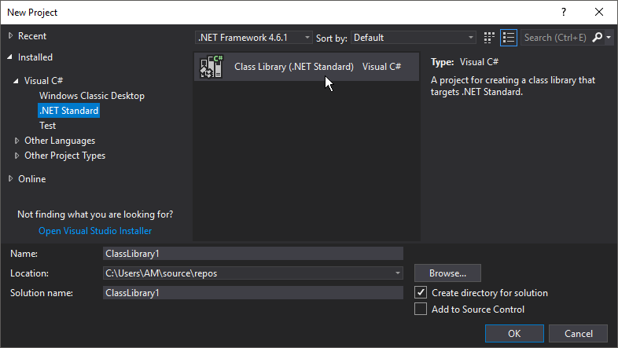
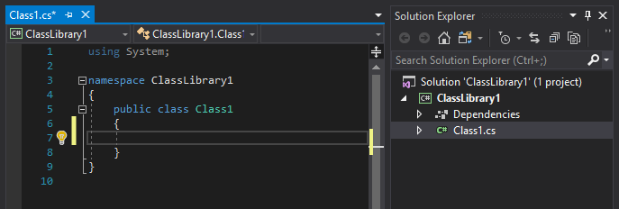

:experimental:
:figure-caption!:

= Writing nodes using C#

Writing your own nodes for VL using C# requires no VL specific knowledge or preparation. Essentially you’re writing plain C# code that VL then turns into nodes. Here is a step by step guide to get you started:

== Start from a Template

In Visual Studio 2017 create a new project by choosing either of those two templates:

- menu:Visual C#[Class Library (.NET Standard)]
- menu:Visual C#[Class Library (.NET Framework)]

As a rule of thumb: Use .NET Standard as long as you can, use .NET Framework if you need. For more confusing information on this, read this link:https://stackoverflow.com/questions/42939454/what-is-the-difference-between-net-core-and-net-standard-class-library-project[Stackoverflow discussion].

.Visual Studio Template Chooser.


NOTE: If you are using Visual Studio 2015 choose menu:Visual C#[Class Library].

This will create a .sln, a .csproj and a Class1.cs file which looks like this:

.Empty generated Class1.cs.


The Namespace you specify here will turn into the nodes category in VL. Nested namespaces (using dot syntax) will be translated to nested categories accordingly. 

Now *any public static operation and every member operation of a public class you write will turn into a VL node*. The most simple node you can write is therefore:

```csharp
namespace MyCustomNodes
{
    public static class MyStaticNodes
    { 
        public static float Add(float input, float input2)
        {
            return input + input2;
        }
    }
}
```

This is basically it. Now build the project and you'll get a managed .dll containing your nodes. From here you continue with link:/reference/libraries/importing_nodes.adoc[Importing Nodes] to use those operations as nodes in VL.

*Image:Resulting Node in VL*

== More Details

Here are some simple examples and a few more details that will help you create your own nodes. Those are also available via:
 https://github.com/vvvv/VL.DemoLib
 
For more general considerations also see: link:/reference/libraries/library_design_guidelines.adoc[Library Design Guidelines]

=== Pin Names

For better readability in VL, an operation's arguments are separated at camelCasing. So "firstInput" in c# turns into "First Input" in VL. The default “return” value is called "Output" in VL.

```csharp
public static float Foo(float firstInput, float secondInput)
{
    return firstInput + secondInput;
}
```
*Image:Tooltip shows pin name*

=== Default Values

Simply use the c# notation for defaults to define defaults for inputs in VL.

```csharp
public static float Defaults(float firstInput=44f, float secondInput=0.44f)
{
    return firstInput + secondInput;
}
```
*Image:Default on Input*

=== Multiple Outputs

Instead of returning a single value you can also use one or even multiple out parameters that will show up as output pins on the VL node:

```csharp
public static void MultipleOutputs(float firstInput, float secondInput, out float added, out float multiplied)
{
    added = firstInput + secondInput;
    multiplied = firstInput * secondInput;
}
```
*Image:A node with multiple outputs*

=== Function Overloading

You can write multiple operations with the same name that only differ in the number of input parameters:

```csharp
public static float MyAddition(float input, float input2)
{
    return input + input2;
}

public static float MyAddition(float input, float input2, float input3)
{
    return input + input2 + input3;
}
```

Choosing the respective node in the NodeBrowser will then ask you for a further choice to specify the which version you want to use.

*Image:NodeBrowser shows two nodes*

=== Using Enums

You can use custom c# enums as input or output types to operations:
```csharp
public enum DemoEnum { Foo, Bar };
    
public static string StaticEnumDemo(DemoEnum e)
{
    return e.ToString();
}
```
*Image:Enum IOBox in VL patch*

For an example of a dynamic enum (ie, one whose entries change during runtime), see below.

=== Using Generics

VL embraces generics, so of course you can write generic nodes easily:

```csharp
public static string Generic<T>(T input)
{
    return input.ToString();
}
```
*Image:Generic pin out of node*

=== Operating on Spreads

The c# IEnumerable<> appears as Sequence<> in VL:

```csharp
public static IEnumerable<float> ReverseSequence(IEnumerable<float> input)
{
    return input.Reverse();
}
```
*Image:Spread node*

=== Documentation

Use XML documentation in C# to provide some information about your nodes:

- Summary: A one-liner info about the node
- Remarks: Some additional remarks, like usage instructions, warnings,.. can be multi-line
- Tags: A list of space-separated tags to find the node in the NodeBrowser (only include terms that are not already part of the nodes name and category!)
- Param name: Short info for each Input
- Returns: Short info about the result of the node
      
```csharp
///<summary>Multiplies input by two</summary>
///<remarks>Some additional remarks</remarks>
///<tags>space separated tags</tags>
///<param name="a">The A Parameter</param>
///<returns>Returns 2 times a</returns>
public static int HTMLDocuTest(int a)
{
    return a*2;
}
```
*Image:Documentation shows up in NodeBrowser and Tooltip*

NOTE: Don't forget to enable "XML Documentation File" in the c# projects properties to make sure the .xml file holding the documentation is generated. This file will then always need to be next to the .dll, therfore always move those two files together!

=== C# Ref Paramters

You can use C# _ref_ parameters, but beware: Assigning the parameter leads to undefined behavior in VL (for now), so never write to but only read from _ref_ parameters!

```csharp
public static int RefParams(ref int firstInput)
{
    return firstInput + 4444;
}
```

=== Datatypes

Any datatype that you define as class or strcut in c# can be used in VL: 

- Any constructor will be available as a Create node
- Any get-property will show up as a node returning the properties value
- Any set-property will show up as a node called Set.. allowing you to set the properties value
- Any public member operation will be available as a node in VL. Private or Protected operations will be ignored.

```csharp
public class MyDataType
{
    private float FX;
    private float FThreshold = 10f;

    public float Y { get; set; }

    public MyDataType(float x)
    {
        FX = x;
    }

    public float AddValue(float value)
    {
        var lastFX = FX;
        FX += value;

        return FX;
    }
}
```
*Image:Corresponding nodes*

=== Events/Observables

VL translates .net events to Observables. So you can simply use events in your code and then access them in VL via the Observable pattern. 

Here is an example of c# events without and with event arguments conforming to the link:https://docs.microsoft.com/en-us/dotnet/csharp/programming-guide/events/how-to-publish-events-that-conform-to-net-framework-guidelines[.NET Framework Guidelines for Publishing Events]:

```csharp
public class MyDataType
{
    public event EventHandler OnValueChanged;
    public event EventHandler<CustomEventArgs<float>> OnValueExceeded;
    ...
}

public class CustomEventArgs<T> : EventArgs
{
    public CustomEventArgs(T value)
    {
        Value = value;
    }

    public T Value { get; }
}
```

In your code those could be called like this:

```csharp
public float AddValue(float value)
{
    var lastFX = FX;
    FX += value;
    if (FX != lastFX)
        OnValueChanged?.Invoke(this, EventArgs.Empty);

    if (FX > FThreshold)
        OnValueExceeded?.Invoke(this, new CustomEventArgs<float>(FX));

    return FX;
}
```
In VL those events are available as nodes of the same name that return an `Observable<EventPattern<>>`:

**Image:How this looks in VL**

In case your event does not have any arguments but simply sends a bang when something happend, use the `On Data` output of the HoldLatest [Reactive] node to be informed of the event. 

If your event does have arguments you'll receive an `Observable<EventPattern<CustomEventArgs<>>>` which you'll have to unpack using the EventArgs [Reactive.EventPattern] node, which is available via the VL.DevLib package. The node then gives you access to the Sender and Value of the EventArgs.

**Image:How this looks in VL**

For general information on workig with Observables see the chapter about link:/reference/libraries/reactive.adoc[Reactive Programming].

=== Delegates

Delegates do not yet get translated to Observables automatically yet. Here is how you can convert a c# delegate to an Observable using a helper function called `Observable.FromEvent()` that comes with the VL.Core nuget:

Let's assume you have a datatype `Body` that has a delegate like:

```csharp
public delegate bool OnCollisionEventHandler (Fixture fixtureA, Fixture fixtureB, Collision collision);
```

and you want to receive a notification when that delegate is called, via the output of a node in VL. 

First you need to create a class for the type of notification you want to receive in VL which in this case may look like this:

```csharp
public class CollisionEvent
{
    public readonly Contact Contact;
    public readonly Fixture FixtureA;
    public readonly Fixture FixtureB;

    public CollisionEvent(Fixture fixtureA, Fixture fixtureB, Contact contact)
    {
        FixtureA = fixtureA;
        FixtureB = fixtureB;
        Contact = contact;
    }

    public bool CancelCollision { get; set; }
}
```

Next you can create e.g. a static operation node that receives an instance of the `Body` in VL and returns an `Observable<CollisionEvent>` on its output:

```csharp
public static IObservable<CollisionEvent> OnCollision(this Body body)
{
    return ObservableNodes.FromEvent<OnCollisionEventHandler, CollisionEvent>(
        body,
        addHandler: handler => body.OnCollision += handler,
        removeHandler: handler => body.OnCollision -= handler)
        conversion: handler => (fixtureA, fixtureB, contact) =>
        {
            var e = new CollisionEvent(fixtureA, fixtureB, contact);
            handler(e);
            return !e.CancelCollision;
        });
}
```
*Image:How this looks in VL*

=== Dynamic Enums

Dynamic enums are useful in cases where you want to offer users a list of items to choose from, where the entries of that list may change during runtime. A typical example are nodes that give access to hardware devices that can be plugged in and removed anytime. 

Consider a normal enum in c#:
```csharp
enum MyEnum = { Foo, Bar }
```
Here `MyEnum` is what we call the type and `{ Foo, Bar }` makes its definition.

And the way we want to use such an enum in our code is to have it as the type of an input parameter to one of our operations,  like this:
```csharp
public static string EnumDemo(MyEnum e)
{
    return e.ToString();
}
```

Now in order to create a dynamic enum for VL we also need those two elements, the type and the definition. Both need to be implemented as classes in c#:

- The type needs to implement `IDynamicEnum` 
- The definition needs to implment `IDynamicEnumDefinition`

both of which come with the VL.Core nuget. 

NOTE: For now the VL.Core nuget is only available as pre-release via http://vvvv.org:8111/guestAuth/app/nuget/v1/FeedService.svc/

To make their use easier there are also two baseclass implementations available:

- `DynamicEnumBase<T, U>`
- `DynamicEnumDefinitionBase<U>`

Note that the DynamicEnumDefinitionBase is a Singleton, meaning that its implementation takes care that always only one instance exists of it globally. We want this because it is important that any node that is referring to a specific enum definition always gets exactly the same entries!

Using the above two baseclasses, an implmentation of your own dynamic enum could look like this:

First derive from the `DynamicEnumBase` to create your own enum type. 

```csharp
[Serializable]
public class MyEnum: DynamicEnumBase<MyEnum, MyEnumDefinition>
{
    public MyEnum(string value) : base(value)
    {
    }

    //this method needs to be imported in VL to set the default
    public static MyEnum CreateDefault()
    {
        //use method of base class if nothing special required
        return CreateDefaultBase();
    }
}
```

The code above most likely doesn't need many changes for your own implementation except:

- Give it a proper name instead of "MyEnum", something like e.g. "MidiInputDevice". Note the singular in the naming: This type represents one entry in the enumeration. 
- Note the second type parameter `MyEnumDefinition` which connects your enum to its definition and should similarly be called "MidiInputDeviceDefinition"

Next derive from `DynamicEnumDefinitionBase` to implement the class that provides the available entries of your enum to the system. Here you only have to override two functions: One that can return a list of current enum-entries as strings and another one that tells the system when your enum-entries have changed. 

```csharp
public class MyEnumDefinition : DynamicEnumDefinitionBase<MyEnumDefinition>
{
    //return the current enum entries
    protected override IReadOnlyList<string> GetEntries()
    {
    }

    //inform the system that the enum has changed
    protected override IObservable<object> GetEntriesChangedObservable()
    {
    }
}
```

Implementations here will vary depending on your usecase. A simple example could look like this:

```csharp
public class MyEnumDefinition : DynamicEnumDefinitionBase<MyEnumDefinition>
{
    ObservableCollection<string> FMyEntries = new ObservableCollection<string>();

    //this is optional an can be used if any initialization before the call to GetEntries is needed
    protected override void Initialize()
    {
        //add two default entries on initialization
        FMyEntries.Add("abara");
        FMyEntries.Add("kadabara");
    }

    //return the current enum entries
    protected override IReadOnlyList<string> GetEntries()
    {
        return FMyEntries;
    }

    //inform the system that the enum has changed
    protected override IObservable<object> GetEntriesChangedObservable()
    {
        return Observable.FromEventPattern<NotifyCollectionChangedEventHandler, NotifyCollectionChangedEventArgs>(
            h => FMyEntries.CollectionChanged += h,
            h => FMyEntries.CollectionChanged -= h);
    }

    public void AddEntry(string entry)
    {
        FMyEntries.Add(entry);
    }

    public bool RemoveEntry(string entry)
    {
        return FMyEntries.Remove(entry);
    }
}
```

NOTE: For the `Observable` type in this example implementation you need to install the 'System.Reactive' nuget.

Lastly there is one thing you'll have to do in VL to get your dynamic enum working: So far when you create a node in VL that has an input typed with your ''MyEnum'', the inputs tooltip will show "null". This is because the VL type system does not know how to deal with the type yet. What we want is that the type-system automatically creates an instance of ''MyEnum'' whenever it encounters it. 

For this to happen we have to specify a default constructor for ''MyEnum'' and this can only be done using a Typeforward in VL!

In the .vl document where you have set a reference to the .dll that holds your enum open the Solution Explorer (Ctrl+J), choose 'Imports' in the dropdown and use the treeview to navigate to your 'MyEnum' class. Unfolding it you should see the 'CreateDefault' operation which you can take and drag-drop onto the document canvas. The name 'CreateDefault' will hint the type-system to use this operation to initialize the type, whenever it encounters the type 'MyEnum'.

For now this also needs a restart but then you should see a valid instance in the pin that uses 'MyEnum' and you can now create an IOBox to control it.

*Image:How this looks in VL*


