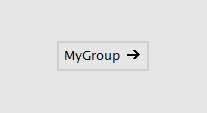

VL 3 structural patches that help you structure your documents:

* Group
* Category
* FullCategory

== Group
Group patches simply allow you to create more space in a document by opening a new canvas. The groups name is merely used for human readability, vl doesn't care about it at all. Create a group by typing "group" in the NodeBrowser.

.Inside a group patch.
image::../../images/GroupsAndCategories/02_GroupInside.PNG[]

.Group patch from the outside.

*Image:The VL.CoreLib organize in groups*

Create a group via the Nodebrowser and give it a name. By default a group opens a new category with its name. Placing operations or datatypes within a group thus automatically sets their category accordingly.

*Image:Name of group spawns new subcategory for all its elements*

Changing a groups name therefore automatically changes the category for all the elements it contains (as long as they don't override it)

In the patch tabs group patches can be recognized by their icon.

*Image:The group 'Foo' among other tabs*

Groups can be nested.