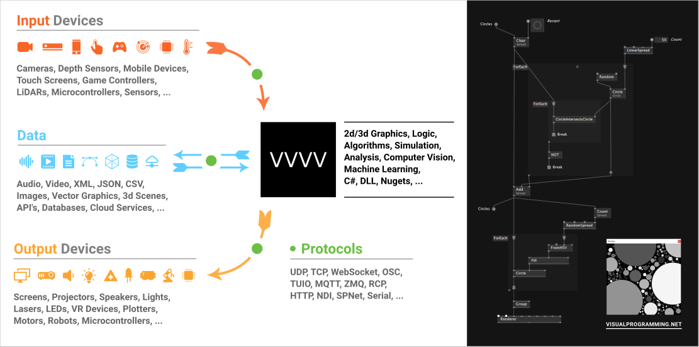

# Welcome to vvvv!

[vvvv](http://visualprogramming.net) is your one-stop-shop for all things digital and interactive media.  
It is a visual live-programming environment that helps you get things done quickly: 

* Generate interactive 2d or 3d motion graphics
* Visualize data coming from network or offline sources
* Control lights, lasers, motors or anything else you can connect to a PC
* In the end, export everything as a standalone program. 
* Missing some functionality? vvvv can consume almost any .NET nuget and can be easily extended using c#.

 

## vvvv beta vs. vvvv gamma vs. VL

* ``vvvv beta`` is the original project, in development since around 2001
* ``vvvv gamma`` is the new version, entirely rewritten from scratch, first released in 2020
* ``VL`` is the name of the visual programming language that is at the core of vvvv gamma and can optionally also be used in vvvv beta

When we speak of just ``vvvv``, in the past we meant ``vvvv beta``, now we mean ``vvvv gamma``. With ``vvvv`` we refer to the whole programming environment, with all its windows, while with ``VL`` we refer more specifically to the language. This distinction is useful, because one fine day VL, the language, may be included in other environments, not only vvvv beta and vvvv gamma...

## Where to start?

Depending on where you come from, you may want to start with one of these introductions:
* [Introduction for Creative Coders](reference/getting-started/cc/introduction-for-creative-coders.md)
* [Introduction for .NET Developers](reference/getting-started/dotnet/introduction-for-dotnet-programmers.md)
* [Introduction for vvvv beta users](reference/getting-started/beta/introduction-for-vvvv-beta-users.md)

Also, vvvv has a built-in HelpBrowser, press <kbd>F1</kbd> to open it. On the ``Learn`` tab 
you find help for each library: Browse the ``Examples`` and ``Tutorials`` first. When you have more specific questions, consult the ``HowTo's`` and ``Explanations``.

Want to watch some vvvv videos first? Visit [vvvvTv](https://www.youtube.com/vvvvtv42) on youtube. There is also a bundle of 30 workshop recordings [avaliable here](https://vimeo.com/showcase/node20workshops).

### The Gray Book

The Gray Book combines a written [Reference](reference/hde/gui.md) and [Explanations](introduction/language.md) for you to explore in addition to the materials in the HelpBrowser. 

## Connect

Any questions left? Get them answered in the [forum](http://discourse.vvvv.org). 
Want to chat with other vvvv users? Join us in the [chat](https://matrix.to/#/#vvvv:matrix.org).
