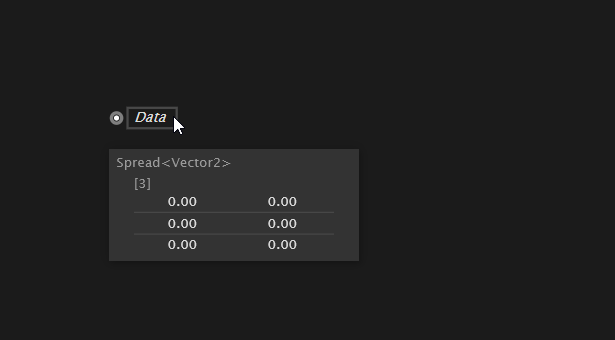
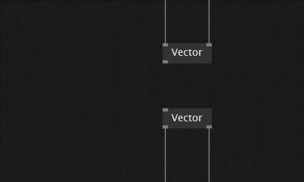

# Data and Data Hubs

Data is everywhere.  And programming pretty much is all about dealing with data.

Programming is creating a description for a machine how to deal with some potentially given data in the future.
In a rapid prototyping system like this you often also have actual current data at hand and are able to inspect that data here and there.

# [Hover on Data](#tab/tabid-1)

 inspecting data by hovering over data-hub

# [Toggle Dataview/Editor](#tab/tabid-2)

 inspecting data by toggling editor-view

***

 

> [!TIP]
> The white dot in the data-hub indicates that the datatype for this one is explicitly set.  (Spread&lt;Vector2&gt; in this case)

However the program you are building is typically concerned with __any data__ that may arrive when the program will run __in the future.__

So you'll be thinking all about
* accepting _data_ & computing with _data_
* extracting features of _data_
* filtering _data_ & yielding _new data_
* feeding back _data_ & saving _data_
* visualizing _data_ & sending _data_
* inspecting _currently available data_
* describing what to do with _data available at any given point in time_
* abstracting over _specific data_ and thinking more in _possible types of data_

For the latter have a look at [Data and DataTypes](data.md).
For now let's just go ahead and make up a few terms: data hubs, data sources, data sinks.

A data hub is something that you can connect to. It's either a data source  or a data sink .
A data source is able to give you data that you can work with. A data sink would love to be given some data from you.
Both let you link to.

Well, actually data flow programming is mainly about linking data sources to data sinks. The idea being that the data flows from a data source into a data sink.

 data source getting linked to a matching data sink
