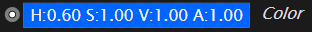

# Data and Data Types

Let's look at some more data:

|Type|Data-Pad|
|---|---|
|Color (RGBA)||
|Number (Integer32)||
|Number (Float32)||
|Boolean (true or false)||
|String (aka a text)||
|Vector2||
|Vector3||
|Vector4||

You get the picture. All of this above is called data. But still all this data differs a lot and often you need to know where to expect which "type of data". Luckily people refer to the "type of data" as the "data type", which just captures this very basic idea of ordering the mess by separating all possible data into different types of data, which themselves refer to all possible data of that type of data. 

E.g. at a particular data source in our patch we expect to get a hand onto some data of type color - in short a color. As soon as we know that data type we know that of all possible data in the world there is just small subset of possible data that may arrive at this particular data hub. The color may be red or blue or even purple, but it has to be a color by all means. If we always needed to think about any possible type of data we'd need to have a lot of fallback solutions in our code for the case it actually is random data that we didn't expect...

Since data and data types are everywhere people started  calling a data type just the "type" skipping the redundant "data" part. 

#### Instances
Data of a certain data type also is called an instance of that data type.

*For the vvvv user:*

*In VL we even distinguish one color from many colors. This lets you build more complex systems and thus help you in the long run. Just keep in mind that a color in VL is something different than a spread of colors.*

More about data: [Basic Nodes and Data Types](lo_9__basictypes.md) and [More On Data](more-on-data.md)

