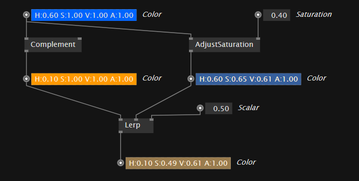

# Data Flow

Data flow in a prototyping environment is about playing with data. For that you place some nodes that offer a promising functionality on your patch which is our name for the canvas. After that you connect the node's data hubs \(also known as pins\). By that you let data flow. Together with the promising nodes this makes up your program.

In the beginning after placing some nodes you'll encounter a whole lot of possible connections you can make. The connections are called links, since they link data source and data sinks. A node e.g. has inputs for the needed data. Inputs on a node thus are data sinks. Outputs of a node offer the data computed by the node to be used somewhere else. Outputs of a node thus are data sources.

Typically you'll be helped by the programming environment to know which links will make any sense. Throughout the system a data source can only be connected to a data sink \(and vice versa\). All data hubs also have a currently associated data type. That is: the system knows which data to expect. This will help you to some degree to prevent some errors which would be hard to find otherwise.

Programming may feel like playing. You are in the middle of creating something! To help you within the process of creating, you may force a connection with SPACE-Click, even if the system currently thinks it doesn't make sense. It may make sense a few clicks later after disconnecting another link!

For more on patching experience and work flow see "The Development Environment".

#### Meaning?

When programming visually with data flow you can link some data from one node to the other. All these nodes are doing their thing and together they form something new, a new functionality. 

At times this is fun, at times this is hard work and needs some thinking. But one way or the other: your goal should always be to strive for a patch that not only solves a particular task and is able to be executed by the machine but also is readable for you later on. Practice making notes and explaining the patch to yourself.

For now of course we'll try to do the job of explaining. Here is an example patch:

 color-data getting processed with operations

The color constant in the top-left is a data source and holds our data we want to process. As you can see the output of the color is connected to two inputs. On the left side it is connected down to a node which will compute the comlementary color and on the right side you see it connected to a node which is used to adjust the saturation. Finally the two data-paths get joined again in the Lerp-node which will give you a color in between the two, positioned by the scalar-input. (0.0 - would give you the first color, 1.0 - would give you the secound color)

