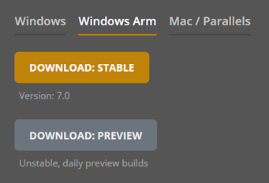

# vvvv on Arm 

Since version 7.0 we offer dedicated builds for running on Arm CPUs. In the download section, switch to the Arm tab to see available downloads:

## Limitations
Unfortunately some libraries will not work with Arm builds of vvvv. This will be the case when a library itself has what are called "native dependencies" that are not available for Arm. In order to find out if libraries might have problems on Arm, run an Arm build of vvvv on an Arm CPU with the commandline argument `--log` and examine the created logfile for warnings like:

`Library Foo contains native assets but none for the current runtime win-arm64...`

Generally we can give the following (incomplete) overview of Arm compatibility for libraries:

### VL.Audio
Using the Resample [Audio.Utils] node will crash vvvv.

### VL.Stride
- compute
- fuse

### Should work
The following libraries do not yet have Arm support, but it seems the underlying libraries do. So it should be possible to get them working with Arm builds of vvvv with some effort:
- VL.OpenCV
- VL.IO.NDI
- VL.CEF
- VL.MediaPipe

### Could work
Support for the following libararies depends on support for Arm CPUs by the creators of the underlying libraries. In case they offer support, we can most likely make them work with Arm builds of vvvv:
- VL.VIOSOWarpBlend
- VL.ScalableDisplay 
- VL.Devices.Zed
- VL.Devices.RealSense
- VL.Devices.Orbbec
- VL.Devices.Nuitrack
- VL.Devices.Ultraleap
- VL.Devices.Decklink
- VL.Devices.IDS
- VL.Devices.TheImagingSource

### Will not work
There is little chance that the below devices will be supported on Arm CPUs by the manufacturer:
- VL.Devices.Astra
- VL.Devices.Kinect
- VL.Devices.Kinect2
- VL.Devices.AzureKinect