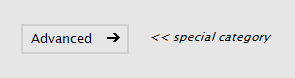
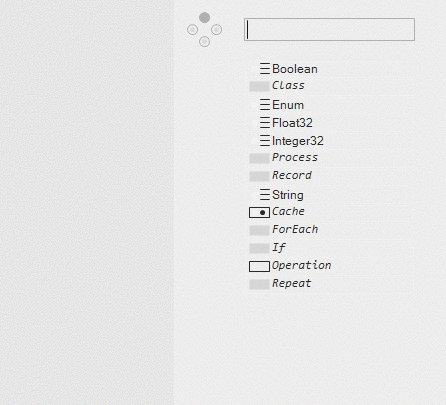

# Aspects

Aspects help a library or project developer to get a better document structure and have a much cleaner looking NodeBrowser.

To add an aspect to a node, you simply put the node into *special categories* created via the Group element in the NodeBrowser. If you create such a category the VL system will pick it up by it's name. It gets removed from the full node category and added as an aspect to all nodes and types anywhere inside it. So for example *MyLibrary.Value.Advanced* or *MyLibrary.Advanced.Value* will simply become *MyLibrary.Value*.

The tooltip then adds the aspect with a '-' behind the node or type name like this:

So in other words, these special categories will not show up in the NodeBrowser but rather inform the NodeBrowser on how to handle the visibility of the nodes in such a special category. Pretty much like a filter on the node list.

The NodeBrowser then has buttons to show/hide nodes with certain aspects:

VL has the following keywords for categories that get converted into an aspect:

* Advanced
* Internal
* Experimental
* Legacy
* Adaptive

These keywords can appear anywhere in the node path, it doesn't matter whether you create them as top-level categories in your document or as sub category in a data type. They can also be combined in any way to make e.g. advanced adaptive nodes.

### Advanced
Advanced is probably the most important aspect. The idea behind it is that any library developer provides a few super cool nodes and types that 90% of all users of a library should use. So the developer wants to have these easy to use nodes show up in the node browser by default. Only if a more advanced use case emerges for the user of the library all other nodes and types should be available as well.

In order to do that a library developer can structure his library as he pleases and then simply place the additional advanced nodes into the category Advanced which informs the node browser to hide them if the Advanced button is off, which is the default (as seen in the gif above).

The NodeBrowser also has a button to show/hide the 'normal' nodes (which is on by default) to make it easy to check your library for consistency.

### Internal
With this aspect the library developer can fine grain the node visibility even further.

_Internal_ makes nodes and types only available inside the .vl document that defines them. It can be used for all little utils and helpers that wouldn't make sense in a different context and should not be "exposed" by the document when it gets referenced by another document.

### Legacy and Experimental
These two should be used for past and future nodes.

Nodes that are not yet finished or are proof of concept for a new technology should be placed in the category _Experimental_. These nodes have to be used with care since they might be unstable or will have breaking changes in the future.

_Legacy_ is quite self explanatory, nodes with this aspect are only there to maintain backwards compatibility and should not be used anymore because there is probably newer/better version available.

### Adaptive
You can create an _adaptive_ category anywhere and it will add all node signatures inside it to the adaptive system, so every type can implement such a node. e.g. the adaptive operators +, -, \*, /, =, ... are placed in the *Math.Adaptive* category, which makes them show up under *Math* in the NodeBrowser.

### Aspects as Version
Aspects also work as version, if you put any of the keywords into the version of a type or operation VL will pick that up as well. e.g. *GetBytes (Advanced)* or *Transform (Normal Advanced)*.

### NodeBrowser Defaults
The default setting for the filter buttons for Advanced, Experimental and External can be adjusted in the settings.xml file. If you are working a lot with .dlls for example, you probably want to enable the 'External' button by default.
