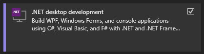

# Choosing a Code Editor

vvvv doesn't include an editor for editing C# code. Instead you can choose your own. Here are some suggestions:

## Visual Studio

[Visual Studio](https://visualstudio.microsoft.com/) >= 2022

During installation make sure to check the ".NET desktop development" workload.

## Visual Studio Code

[Visual Studio Code](https://code.visualstudio.com/)

After installation make sure to install the "C# Dev Kit" extension.

## JetBrains Rider

[JetBrains Rider](https://www.jetbrains.com/rider/)

## Text Editors

If you don't have any of the above editors at hand, really any text-editor would do to simply edit the C# code. Obviously you'll be missing out on some convenience, but for simple scenarios this may be enough. 