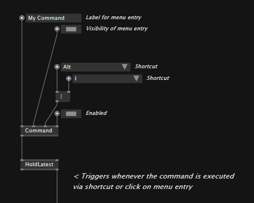

# Editor Extensions

Editor extensions allow you to extend the vvvv editor with your own tools. Examples of such extensions shipping with vvvv by default, are:

- The Key & Mouse display

Extensions can be entirely patched in vvvv and assigned a shortcut so they can be called by the user at anytime. You can find all currently loaded extensions in the main menu under:

`Quad > Extensions`

## Creating an extension

Extensions are ordinary VL patches, with the one distinctive feature, that they are saved in a file ending in `.HDE.vl`, like:

`VL.MyExtension.HDE.vl`

Any such file that you have open in vvvv, is already running as an editor extension. You'll now most likely want to be able to invoke your extension by a shortcut or menu-entry. For this you'll have to register a command which you can do via the `Command` node that is available via referencing the `VL.HDE` nuget. 

Or simply start from the template:

## Creating an extension from the template

From the main menu choose:

`Quad > Extensions > New Extension...`

and specify the destination and filename for your new extension .vl document in the file save dialog.

> [!NOTE]
> The filename must end in `.HDE.vl` in order for the file to be a valid editor extension.

This copies the template to the given destination and opens the document for you, which should look like this:

Note the `Command` node here that allows you to register a command with the editor, by specifying:
- A label for the menu entry
- Whether the menu entry is visible
- A shortcut

Now check the output of the `Command` that will trigger whenever the command is executed via shortcut or click on menu entry.

You take it from here. A classic usecase will be showing/hiding an editor extensions window on repeated executions of the command. But as within any other patch, you're free to run even `format c:` here, so as always, handle with care...

## Multiple extensions per .HDE.vl file
If that is what you need, then yes, simply register multiple commands in your document. 

Note though, that should one of your extensions have a runtime error, all the others running in the same document, might be affected as well. 

## Packaging extensions in a nuget
In order for vvvv to pick up editor extensions from installed nugets, their nuget ID also has to end in `.HDE`, e.g.:

`VL.MyExtension.HDE`

which in turn requires the .vl document inside that nuget to be following the same naming and be called:

`VL.MyExtension.HDE.vl`

## Debugging Extensions
tbd