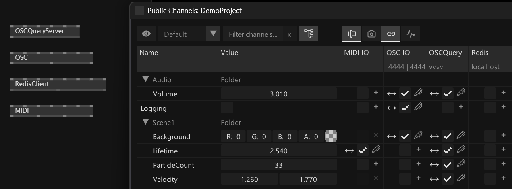
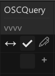
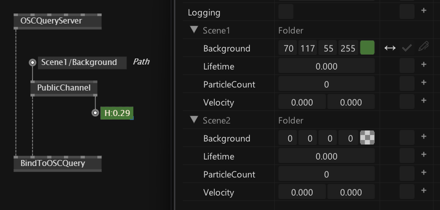

# Bindings

Bindings offer a unified way to expose [Public Channels](the_channelbrowser.md) from your app and allow them to interact with the outside world. Think easy connections to RCP, OSCQuery, OSC, Midi, Redis,...

<small>Binding columns for MIDI, OSC, OSCQuery and Redis established by the respective nodes</small>

## Adding Binding Columns

Before you can add a binding you need to establish the existence of a binding service using already familiar nodes from packages like VL.IO.Midi, VL.IO.OSCQuery,...

For OSCQuery, eg. simply place an OSCQueryServer node to get a new binding column in the channel browser.

For each channel you see the following:
- Direction: Arrows indicating incoming and/or outgoing values
- Status: The checkbox shows whether or not the binding is active
- +/🖊: Buttons to add or modify a binding

## Adding Bindings
There are two ways to add bindings to a public channel:
- Via the Channel Browsers "Binding" columns
- Using a BindTo... node

Once you have a binding column, you can activate individual bindings for public channels by simply clicking the according checkbox in the column. For all binding types (except MIDI) this is already all you needed to do to get a default binding running. In case you want more finegrained control, you can tweak most bindings using the 🖊 button.

Alternatively you can establish bindings to channels (including non-public ones) using the BindTo... nodes coming with the respective IO packages. So for OSCQuery, eg. use the BindToOSCQuery node and you're done.

Note that also multiple bindings are possible to a single channel. Like this you can e.g. define that a value that comes in via MIDI, should go out via OSC or the other way round...

## Removing Bindings
Unchecking a checkbox in a binding column or removing a BindTo... node removes the binding. 