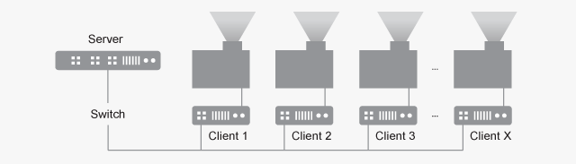
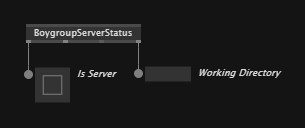
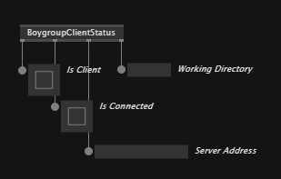
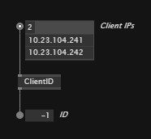

# Boygrouping

Boygrouping is vvvv's distributed rendering system. It allows to run a project from a single PC but have any number of PCs connected that render outputs of individual views [n'sync](https://en.wikipedia.org/wiki/NSYNC).

Like this, vvvv can drive projections or screens of any size with realtime or video content while the app is being live-edited.

arge led screens, example dataland, Combine this with the stereoscopic rendering feature and building systems like a CAVE or  dome of any size with realtime content.

## What it does

Primarily, boygrouping synchronizes your projects patches (ie. the source code), from a server to all the connected client PCs. Any change you make to a patch is instantly transmitted to and applied on all clients. So there is no need to manually deploy the app and re-start it on all clients! 

This also includes any [pack](https://vvvv.org/packs) referenced in patches. Assuming the clients have internet access just like the server, they will automatically download all packs as needed.

In addition to source code changes, Pausing [F6], Stepping [F7], Stopping [F8], Starting [F5] or Restarting [F9] the app on the server will also execute those commands on the clients. 

## Usage
In order to run a boygroup, you need to start vvvv with the following commandline arguments:

### Server

The server is your main PC. Here you start vvvv with the "bind" argument to specify which IP to run the server on. If no port is given, it defaults to 5000:

    --bind IP:Port 

The "working-directory" argument is needed so that vvvv knows which .vl documents to synchronize. Only .vl documents residing in the specified working-directory, will be transferred to the clients!

    --working-directory path/to/working-dir

Examples:

    --bind 192.168.0.10 --working-directory C:\MyProject
    --bind 192.168.0.10:34556 --working-directory C:\MyProject

### Clients

On the render PCs, start vvvv with the "server" argument to specify which server to connect to. If no port is given, it defaults to 5000:

  --server IP:Port

The "working-directory" argument is also required. The specified directory is the one that vvvv resolves relative paths to. 

    --working-directory path/to/working-dir

Any assets referenced in a patch need to be available in that path! For mirroring assets, [see below](#mirroring-assets).

Examples:

    --server 192.168.0.11
    --server 192.168.0.11:34556

>NOTE
>- The working directory does not have to be the same on Server and Clients!
>- The order in which you start server and clients, does not matter: The server is always listening for new connections and clients periodically try to connect to their specified server.

### Status nodes

The `BoygroupServerStatus` node returns:
- Is Server
- Connected Clients: currently connected clients
- All Clients: a history of connected clients
- Working Directory

The `BoygroupClientStatus` node returns:
- Is Client
- Is Connected
- Server Address
- Working Directory

### ClientID node
In case you need a unique ID on each of your clients, you can use the `ClientID` node. Feed it all IPs of your clients in the desired order and on each client the node will return the respective ID. On the server it returns -1:

In scenarios where you don't want to tie the ID to the clients IP, you can can start each of your clients with a unique id passed as a commandline argument. Have a look at "HowTo Use Configuration" in the [Help Browser](../hde/findinghelp.md) to learn about parsing custom commandline arguments. 

### Debugging

When there is need to debug behavior on a client, simply remote into it with a thirdparty tool like [RustDesk](https://rustdesk.com/). This gives you full access to the clients vvvv editor to inspect values and even make changes to the patch. 

In case you want to apply such local change you made on a single client back to the server, do as follows:
- On the server enable the [Setting](../hde/settings.md) "Auto reload documents"
- On the client save the document

This transfers the clients' local changes back to the server which subsequently distributes it to all other clients.

## Related topics

### Mirroring Assets
Boygrouping does not automatically sync any assets! As of now, boygrouping really only works for .vl documents. Any referenced .sdsl or .csproj files or any kind of content assets still have to be mirrored manually. 

No need to reinvent the wheel here, check out [Remoter](https://github.com/vvvv/Remoter) that will help you with this.

### Synchronisation
If you need frame-perfect sync for applications like LED walls or stereoscopic rendering, first make sure you have a hardware [genlock](https://en.wikipedia.org/wiki/Genlock) in place using e.g. NVIDIA Quadro Sync cards which you can configure with [VL.Nvidia.NvAPI](https://forum.vvvv.org/t/vl-nvidia-nvapi/23968).

As alternative to working with a synced framecounter from NvAPI you can use [PTP](https://en.wikipedia.org/wiki/Precision_Time_Protocol) to sync your system clocks and then simply rely on that. Configuring PTP is a bit tricky, here are your options:
- [Use free tooling](https://thegraybook.vvvv.org/reference/best-practice/ptp.html)
- [Use a commercial tool](https://www.greyware.com/software/domaintime/)

For synchronizing values, we recommend working with [Public Channels](https://thegraybook.vvvv.org/reference/hde/the_channelbrowser.html) and [Bindings](https://thegraybook.vvvv.org/reference/hde/bindings.html).

### Splitting Views
Splitting a single cameras perspective over multiple outputs is often needed in boygrouping scenarios. Have a look at the help patch of the `LookAtRectCamera` node shipping with VL.Stride. With it you can create seamlessly connected off-axis camera frustra for multiple outputs sharing a single perspective.

### Launching Clients
Once in a while you'll want to re/start vvvv on all clients simultaneously. Be it because you need to change launch arguments or recover from a crash. 

For those scenarios please have a look at [Remoter](https://github.com/vvvv/Remoter) which allows you to do this for vvvv but also for any other app you may need to manage on a range of clients.

### Projection Mapping
Large-scale often means projection-mapping. Since requirements here are rather diverse, vvvv comes with support for [different options](https://vvvv.org/packs/?c=Projection%20Mapping) including auto-calibration systems by [Scalable Display](https://www.scalabledisplay.com/) or [VIOSO](https://vioso.com/).

### Stereoscopic Rendering
Assuming you have the required hardware, stereoscopic rendering can easily be activated. Have a look at the help patch of the `StereoSettings` node shipping with VL.Stride to learn more.