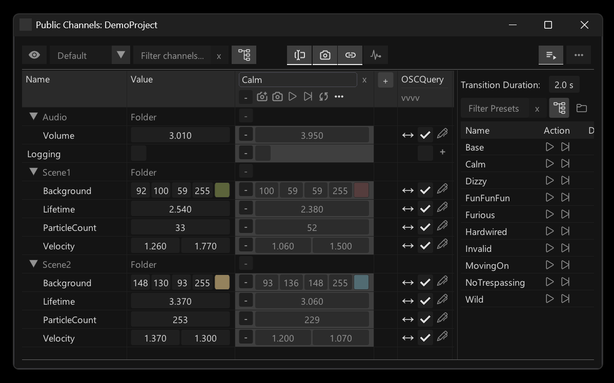

# The Channel Browser

The Channel Browser <kbd>Ctrl</kbd><kbd>F4</kbd> lists all public channels. By default it will show the channels names and values.

## Presets & Transitions

## Bindings

## Monitor