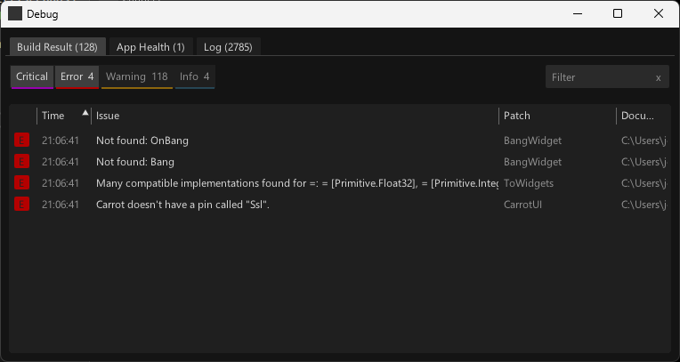

# Build Result

**As of vvvv gamma 5.3-preview 413**

Here you'll see errors, warnings and infos that came up as a result of the build process. Whenever vvvv is building your patches (ie. whenever you make a change), this list is cleared and you'll get a fresh view of the latest issues. 

Most commonly, you'll see errors relating to: 
* Missing dependency references or nodes
* Typing issues on links, pins, or pads

Double-clicking an entry brings you to the source of the message: right in the patch, where you'll find the same issue visualized as a red or yellow node, link, pin, or pad.
While the patch is the place that allows you to understand and fix a problem, the Build Result view is supposed to help you:
* Zoom out and understand the big picture of build issues
* Navigate and find the root issues

Keeping this list in check is the basis of a [healthy app](debugging-apphealth.md).

**Remarks**
* Typically only the Errors are of interest
* vvvv can build patches with errors. This allows for faster iterations and refactorings. You don't need to fix every error to test a new idea. If you are in the process of such a refactoring you might see a lot of errors. The Build Result view reminds you of those, but don't feel bad. Sometimes when developing bigger patches, this is just part of working, a proof that things are moving. Decide for yourself when it's about tackling those errors again. For sure, when testing your app, searching for a bug is easier if there are no build errors left
* Warnings: There are too many of them typically and it's quite hard to get rid of them. So it's a bit tricky to take them seriously. However, they still have a purpose which is trying to help you with reasoning about what your app does. Especially when it comes to object mutability and order of execution