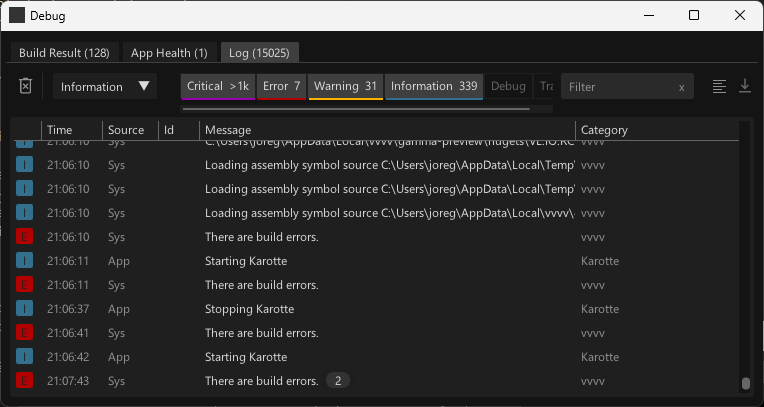

# Log

**As of vvvv gamma 5.3-preview 413**

The log is collecting all messages over time and shows you the whole history, until you clear it or the buffer runs over (Buffer length defaults to 5000 but can be configured via the Settings).

Here you'll find all messages sent by the system, but also by your app. To distinguish between those, see the "Source" column. 

To create log messages from your patches use the Log [System.Logging] node. 

The interesting thing with logging is that you can also route logs to any [logging provider](https://learn.microsoft.com/en-us/dotnet/core/extensions/logging-providers) you prefer. In a real-life project you may want to log certain messages to a file and others to a cloud service. Anything is possible, see at "HowTo Configure logging providers" in the helpbrowser.

### Log UI in your own application

When exporting your application, by default you've now lost the ability to view your log messages, since the above Log window is part of vvvv itself and not your app.

Yes you still have all the possibilities to use any thirdparty log providers but you may also want to have a log window as part of your application, see "HowTo Use the log view in an exported application" for how to set this up.