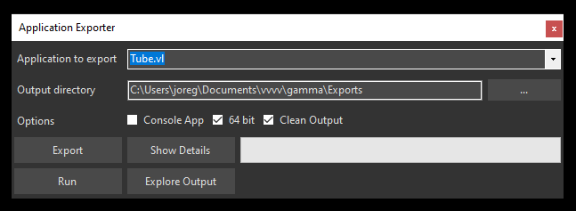

# Exporting Applications

vvvv allows you to export a patch into an executable, standalone program. In order to do so, open the Application Exporter via `Quad > Export...`.

The Application Exporter (Shortcut: F9)

* Application to export: Choose which application to export (in case you're working on multiple projects at the same time)
* Output directory: Choose where the exported program and files will be created
* Press the __Export__ button and wait until the green progressbar is full and the __Run__ button becomes available
* Press __Run__ to test/run your program
* __Explore Output__: opens a file explorer at the specified output directory

## Output Directory
After a successful export, the output directory will contain a directory with the name of your application. Inside this directory you find the executable. To run the program on another PC you need to copy the whole content of this directory.

### Source Directory
Next to the application directory you'll also find a \src directory. This is an artefact that vvvv creates during export and can be safely deleted.

> [!NOTE]
> .NET developers my find this interesting though as it contains a completely valid c# solution of the exported project that can be opened, viewed and modified with Visual Studio.

## Assets

Using referenced external assets in exported executables for now is a bit cumbersome:

Instead of using path IOBoxes to reference files, you have to use a combination of the node __ApplicationPath__ and a string of the relative path to your asset. Also after export you have to manually copy the assets to the output directory!

Creating paths relative to the exported executable

> [!NOTE]
> During development a path created like that will be relative to your main .vl document. When exported, it will be relative to the executable.

## Configuring a renderers appearance

Referencing the nuget VL.CoreLib.Windows adds the following nodes:

* SetWindowState and WindowState
* SetWindowMode

These allow you to configure the renderers caption, controlbox, framing and more.

## Troubleshooting
In case the export fails, the console will be opened to show there was an error.

The Application Exporter reporting a problem

Please send us the console output by pressing "Copy To Clipboard" and pasting it to us via forum or chat.

## Code Signing
In order to have your executables to run without a warning on other PCs, you need to sign them with a certificate using [SignTool](https://docs.microsoft.com/en-us/windows/win32/seccrypto/signtool).