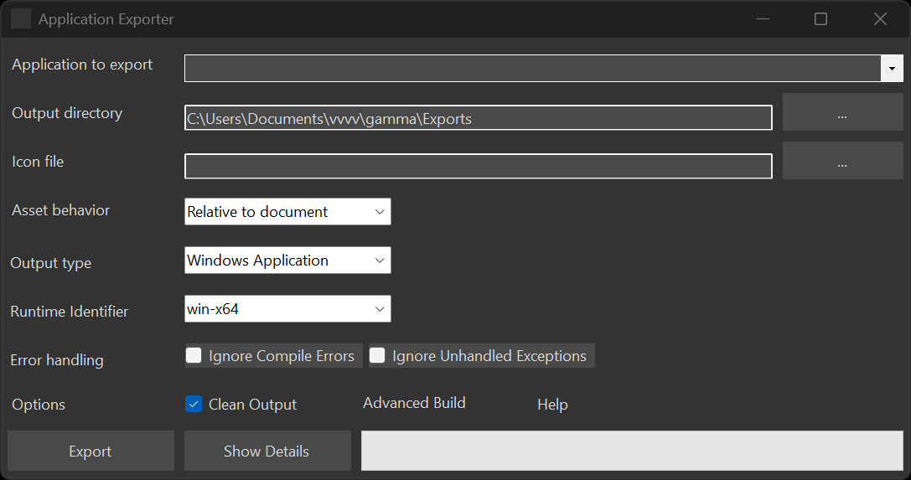

# Exporting Applications

vvvv allows you to export a patch into an executable, standalone program. In order to do so, open the Application Exporter via `Quad > Export...` or shortcut <kbd>F10</kbd>.

The Application Exporter

## Application to export
Choose which application to export (in case you have multiple projects open at the same time).

## Output directory
Choose where the exported program and files will be created.

After a successful export, the output directory will contain a directory with the name of your application. Inside this directory you find the executable. To run the program on another PC you need to copy the whole content of this directory.

## Icon file
Choose an .ico file to be associated with the generated executable.

## Assets
Choose how assets will be referenced in the exported application:
* **Relative to document**: This option is most useful during development, to quickly test exports without having to worry about moving assets around. Assets will be referenced from where they are. 
* **Relative to output**: Use this option for final exports: It requires you to manually place your assets relative to the generated executable as they were relative to your root document during development. Like this the whole output can then be moved around and deployed to other PCs.
  
## Output type
> [!NOTE]
> This is only available from versions 5.0 on!

Choose between Windows (GUI) or Console application. A Console app will open a Windows Console and run the Update operation for only one frame, then immediately Dispose itself. 

Use a __KeepAppAlive__ node to prevent this default behavior.

## Target OS
> [!NOTE]
> This is only available from versions 5.0 on!

Choose the OS for which to create output for. If you choose *Any*, export will create executables for all available targets, otherwise only for the one selected OS.

## Platform target
> [!NOTE]
> This is only available from versions 5.0 on!

Choose between CPU architectures x64, x86 or any.

> [!NOTE]
> If a 32bit application that references VL.Stride fails to run on a PC, make sure it has [Microsoft Visual C++ Redistributables 2013 and 2019](https://docs.microsoft.com/en-US/cpp/windows/latest-supported-vc-redist?view=msvc-160) for x86 installed.

## Options
### Console App
Choose between Windows or Console app. A Console app will open a windows Console and run the Update operation for only one frame, then immediately Dispose itself. 

Use a __KeepAppAlive__ node to prevent this default behavior.

### 64bit
Disable to export for 32bit architectures.

> [!NOTE]
> If a 32bit application that references VL.Stride fails to run even on your developer PC, make sure it has [Microsoft Visual C++ Redistributables 2013 and 2019](https://docs.microsoft.com/en-US/cpp/windows/latest-supported-vc-redist?view=msvc-160) for x86 installed.

### Clean Output
If active, removes artefacts of previous exports (ie. deletes the \src folder) before exporting. This will cause exports to take longer but also makes sure previous artefacts don't interfere with the new export.

## Export
* Press the __Export__ button and wait until the green progressbar is full and the __Run__ button becomes available
* Press __Run__ to test/run your program
* __Explore Output__: opens a file explorer at the specified output directory

### Source Directory
Next to the application directory you'll also find a `\src` directory. This is an artefact that vvvv creates during export and can be safely deleted.

> [!NOTE]
> .NET developers may find this interesting though, as it contains a completely valid c# solution of the exported project that can be opened, viewed and modified with Visual Studio.

## Dependencies
If your application is referencing VL.Stride, make sure the target PC also has the following dependencies installed:

* [Microsoft Visual C++ Redistributables 2013](https://aka.ms/highdpimfc2013x64enu)
* [Microsoft Visual C++ Redistributables 2015](https://aka.ms/vs/17/release/vc_redist.x64.exe)
* [.NET6 SDK](https://dotnet.microsoft.com/en-us/download/dotnet/6.0) (For FileTexture and FileModel nodes to work)

### 2021.4.12
For applications exported with this older version of vvvv, you'll also have to install:
* [MSBuild Tools](https://visualstudio.microsoft.com/thank-you-downloading-visual-studio/?sku=BuildTools&rel=16)

## Advanced build configuration
> [!NOTE]
> This is only true for 2022.5 preview builds!

The build process can be customized in many details. Next to your main .vl file, place a .props file with the same name. This is actually an .xml file which you can configure to your needs using [MSBuild](https://docs.microsoft.com/en-us/visualstudio/msbuild/msbuild-concepts?view=vs-2022) syntax.

## Useful nodes
- Args [System] to access commandline arguments the app was called with
- Nodes from the advanced [System.Console] category

## Useful libraries
- [Terminal.Gui](https://github.com/migueldeicaza/gui.cs) for creating console applications with a text based UI

## Configuring a renderers appearance

Referencing the nuget VL.CoreLib.Windows adds the following nodes:

* SetWindowState and WindowState
* SetWindowMode

These allow you to configure the renderers caption, controlbox, framing and more.

## Code Signing
In order to have your executables to run without a warning on other PCs, you need to sign them with a certificate using [SignTool](https://docs.microsoft.com/en-us/windows/win32/seccrypto/signtool).

## Troubleshooting

### Export fails
In case the export fails, the console will be opened to show there was an error.

The Application Exporter reporting a problem

Please send us the console output by pressing "Copy To Clipboard" and pasting it to us via forum or chat.

#### Export fails With 2021.4.x
There is a known incompatibility with newer versions of MSBuild tools than what vvvv expects. So in order to make sure the right version of MSBuild tools is installed do as follows:
- Uninstall all versions of Visual Studio and Build Tools you can find on your machine 
- Then run the vvvv 2021.4.x installer again with having the “Build Tools” checkbox enabled

### Exported app doesn't run on target PC

Chances are that you're missing a dependency on the target PC. See [Dependencies](#dependencies) above.
