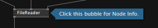
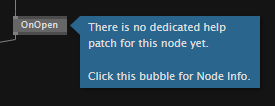
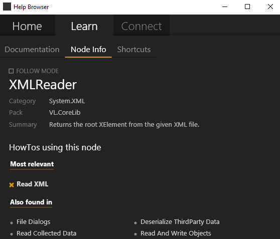

# Finding Help

## Help Patches
Press `F1` on a selected node to open its help patch. If a help patch is found for the node, it opens and marks the node you were interested in with a bubble.

The bubble indicating which node the help patch was opened for

Clicking the bubble will open the help browser showing the Node Info.

In case no help patch is found for a node, a bubble will pop up next to the node, indicating the fact that the node does not have a dedicated help patch. You can then still click the bubble to show the Node Info.

The bubble indicating there is no help patch for this node

## Help Browser
Open the help browser by pressing `F1` while no node is selected in the patch or choosing it from the menu `Help Browser`.

## Node Info
Node Info is available for every selected node. Next to information about the node it also shows you three lists of HowTos using this node. Click the entries in the list to open the how-to patches relevant for the selected node.

