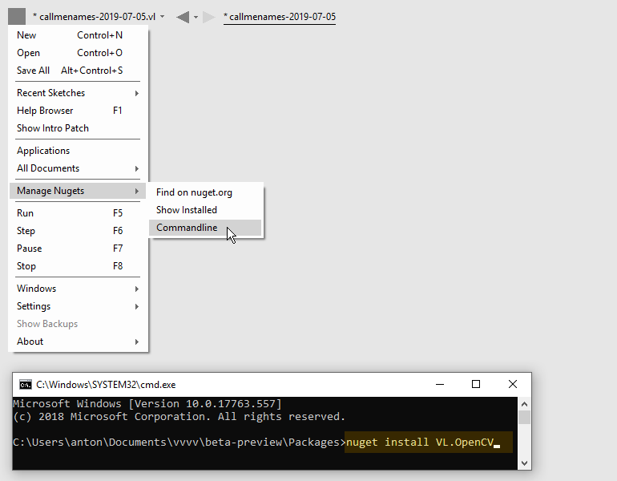

# Managing NuGets

Installing a nuget via the commandline

## Find on nuget.org
Opens a webbrowser and lets you search for NuGets in the [online repository](https://nuget.org). Note that for now, after you've found what you're looking for, you'll still have to install a NuGet manually via the commandline.

## Show installed
Opens a file explorer at the path all your nugets are installed locally. By default this is in your users directory:
 
    AppData\Local\vvvv\gamma\nugets

but can be changed using the commandline argument "nuget-path", see [Commandline Arguments](commandline-arguments.md).

## Commandline
Opens a commandline from which you can run [nuget commands](https://docs.microsoft.com/en-us/nuget/tools/nuget-exe-cli-reference).

### Installing the latest version of a NuGet
To install the latest version of a NuGet simply run `nuget install`, like e.g:

`nuget install vl.opencv`

After installing a NuGet via the commandline it is not yet automatically referenced by the current document! It is now merely available among the NuGets via the [Dependencies menu](navigating_a_project.md#dependencies). But if an installed NuGet contains any help files, those will already show up in the [HelpBrowser](findinghelp.md#help-browser).

> [!NOTE]
> To update to the latest version of a NuGet you have already installed, simply run the install command again. Your package directory can contain multiple versions of the same nuget and VL will always use the newest. Older versions have to be removed manually if no longer needed.

### Installing a pre-release version
Sometimes you may want to install a "pre-release" version of a package. To install those, add the argument `-pre` when running the install command, like e.g:

`nuget install vl.audio -pre`

### Installing a specific version
Sometimes you may want to install a specific version rather than just the latest. In this case, use the `-version` argument when running the install command, like e.g:

`nuget install vl.opencv -version 2.1.0`

> [!NOTE]
> vvvv will always load the newest version of a NuGet it finds installed. So in case you want to run a specific older version of a package (downgrade), make sure you don't still have newer versions of it and its dependencies around. 
>
> To remove versions of a NuGet, go to [Show Installed](#show-installed) and delete respective folders from there. If deletion fails, make sure to close vvvv first.

In the [NuGet Compatibility Chart](../../changelog/nuget-compatibility-chart.md) we are collecting packages and their recommended versions for specific vvvv releases. 

### Troubleshooting
If running the `nuget install` command returns with an error hinting at the nuget not existing but you're certain that it does and you spelled it correctly, there is an off-chance that your [NuGet.Config](https://learn.microsoft.com/en-us/nuget/reference/nuget-config-file) file is corrupt. You'll find it in:

    C:\Users\..\AppData\Roaming\NuGet

Rename the existing file to have a backup just in case. Then try to run the install again, which will recreate a working version of NuGet.Config automatically.
