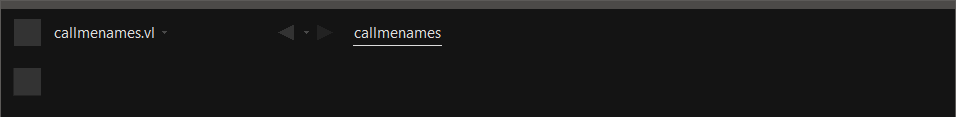
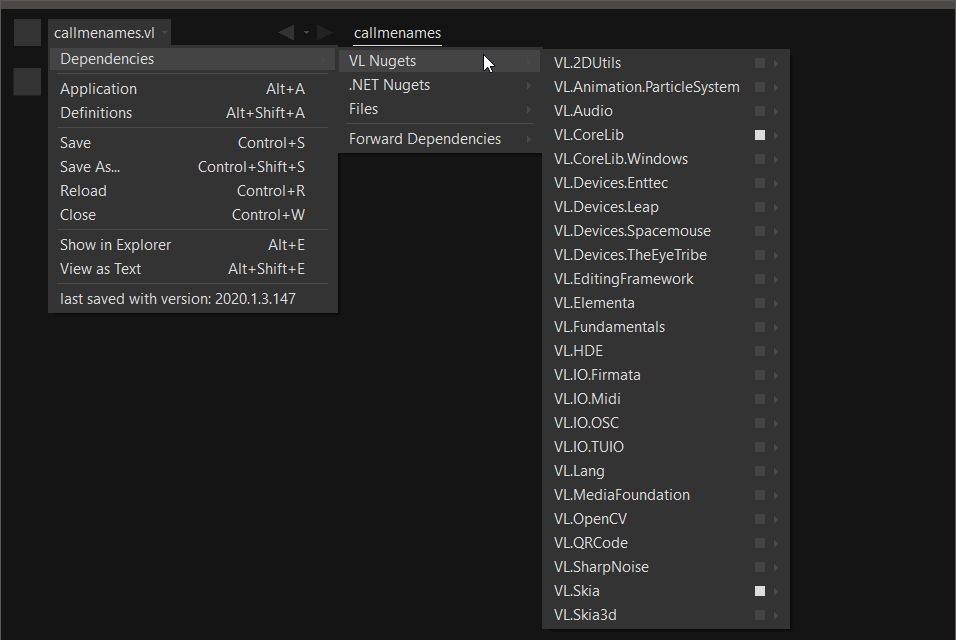
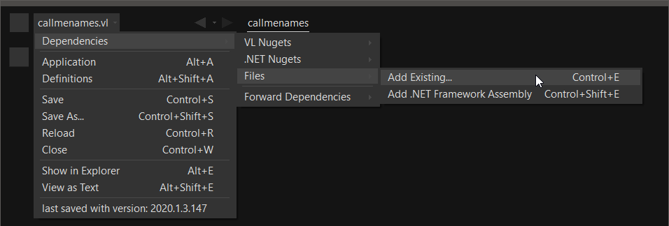
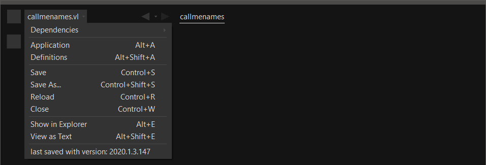
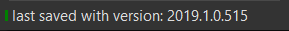
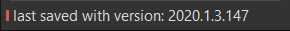

# Navigating a Project

A project in VL typically consists of a single .vl document that holds one ore more patches. In addition a document can depend on other documents or Nugets whose nodes it can access.

In the main menubar you always see the filename of the document you're currently working on, ie. the "Active Document".

The main menubar with the Active Document "callmenames.vl"

## Active Document Menu
Clicking on the active document opens its menu. 

### Dependencies
A document can reference different types of dependencies:

* VL Nugets
* .NET Nugets
* Files

Document's dependencies

#### VL Nugets
Navigate to "VL Nugets" to see a list of all available Nugets exposing nodes for VL. Each Nuget is a collection of documents (.vl, .dll, ...) that provide nodes for a document. 

A version in brackets next to a Nuget means that the currently loaded version of the Nuget is different to the version that was originally referenced.  > meaning the referenced version being smaller,  < meaning the referenced version being bigger  than the currently loaded version.

Available Nugets

Rightclick a Nuget to select it. Selected Nugets provide access to all their nodes via the nodebrowser in that document.

#### .NET Nugets

In the ".NET Nugets" section you find all Nugets that are not tailored for VL. That means you can still absolutely use them, but depending on the complexity of the library this may be a bit more advanced endeavor.

#### Files
In addition to Nugets you can also reference individual files of the following types:

* .vl
* .dll
* .csproj

Add Files

Choose "Add Existing..." to select a file via the file browser. All nodes that are exposed by those files will be available in your active document via the nodebrowser.

#### Forward Dependencies
In this section you see a listing of all Nugets and files combined. Here you can specify if the nodes of a specific dependency will be forwarded or not.

If a dependency is not forwarded, its nodes will only be visible in the current document. They will not be seen by a document that references the current document.

If a dependency is forwarded, its nodes will also be seen by any other document that references the current document.

## Application
See [Application Patch](../language/patches.md#application-patch).

## Definitions
See [Definitions Patch](../language/patches.md#definitions-patch).

## Last saved with version
At the bottom of the menu you see the VL version the document was last saved with. If there is a little green or red icon before the document name, this means that the document has been saved with a version different to the one currently running.

In this example gamma version 2020.1.3.147 is running

*Green* 

A little green symbol next to the document's name is a hint that the document was upgraded to the currently running version, which is usually just fine. Still this hint is given so you know that if you save the document in this version it may have troubles being loaded in an older version.

*Red*

A red symbol is a warning that the document was last saved with a newer version and therefore things may not look/work as expected. In that case consider running a newer version of VL to open this document.