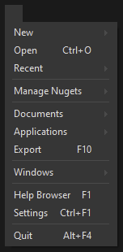
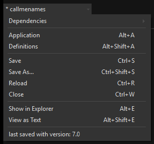
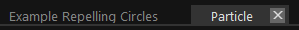
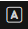
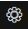

# Overview

## The Quad menu
The Quad menu collects all global commands.

It gives you quick access to:
- Recent Sketches: For quickly accessing most recent .vl documents you've been working on
- [Managing Nugets](managing-nugets.md)
- Documents: A listing of all currently open .vl documents
- Applications: A listing of all currently open main entry points
- [Exporting Applications](exporting.md)
- Windows like [Extensions](extensions.md), the [Documentation Window](documentation.md) and the [Solution Explorer](solution-explorer.md)
- [The Helpbrowser](findinghelp.md#help-browser)
- [The Settings](settings.md)

## The document menu
The document menu collects all commands relevant for the active document.

It gives you quick access to:
- Configuring the documents [Dependencies](navigating_a_project.md#dependencies)
- The documentes [application patch](../language/patches.md#application-patch)
- The documents [definition patch](../language/patches.md#definitions-patch)
- Saving, reloading, closing the document
- Jumping to the document in the Explorer
  
## Document Tabs

Shows titles of all open patches.

## About

Can be invoked via <kbd>Shift</kbd><kbd>F1</kbd>

- The About dialog including 
  - Version and licensing info for vvvv itself and all used open source libraries
  - Links to this documentation, the [Changelog](../../changelog/index.md) and [Roadmap](../../roadmap/index.md)
- Licensing Terms including a link to the [vvvv License Store](https://store.vvvv.org)

## Settings

Can be invoked via <kbd>Ctrl</kbd><kbd>F1</kbd>

Gives you quick access to: 
- [Settings](settings.md)
- [Themes](themes.md)