# Packman

Available for testing in **[vvvv gamma 8.0 preview builds](/download)**!

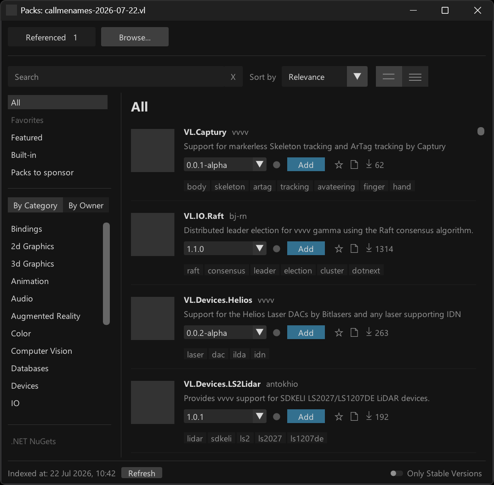

## Basic Usage

For basic usage there is not much you need to know:
- Open Packman using Ctrl + F3
- Choose the "Browse..." tab
- Find the pack you want to use
- Click the blue "Add" button to download and reference it to your active document
- Done
  
If you now save your vl document and open it on another PC, vvvv will automatically download all referenced packs.

Where does vvvv download packs to? The beauty: You don't have to care (somewhere in a system nuget cache). The \nugets folder you've had to manage in earlier vvvversions does not play any role in vvvv gamma > 8.x anymore. 

That's mostly what you need to know for a start. 

## Updates 

Next thing you may encounter is that a new version was released for a pack that you reference. Packman will hint this to you like:

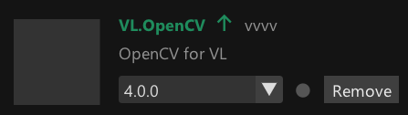

In case you want to update, simply choose the new version via the dropdown:

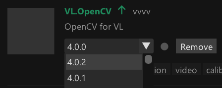

vvvv will now download and reference this new version but also ask you to restart: 

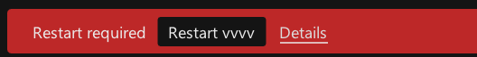

The reason for the required restart is that vvvv cannot replace the version of a pack at runtime. So only a restart makes sure that the newly selected version of the pack is loaded! You can savely click the "Restart vvvv" button there, and vvvv will re-open in the exact same state you were in but with the new reference loaded.  

## Version mismatches

A version mismatch warning generally shows up for referenced packs if the version you've chosen does not match the version of the pack that is currently loaded.

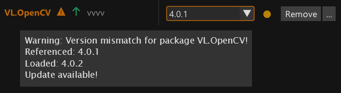

This can happen under different circumstances:
- If you see this warning after you've just changed the version of a pack, a restart is required to make sure the newly selected version of the pack is loaded (see above)
- In case multiple of your documents explicitly reference a different version of a pack you'll have to sort things and decide on one version for your whole project (see "Reference no specific version" below)
- If the warning shows up on a pack that has the "Built-In" tag, you need to understand the role of those packs, read on:
  
## Built-in packs

vvvv ships with a range of packs that it needs itself to run. You can see those listed in the Built-in section:

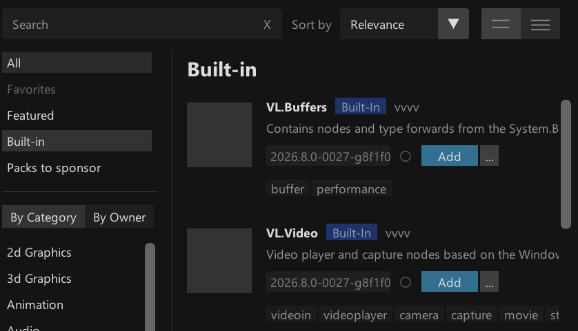

The exact version of those packs is defined per version of vvvv and cannot be changed! 

If you have a version mismatch with one of those, you loose. In such cases, the only thing that helps is choosing "No specific version", read on:

## Reference no specific version

In order to reduce "Version mismatch" warnings with built-in packs and help managing versions of packs across multiple documents there is a special feature: When referencing a pack, you can choose to "not use a specific version". This means that you're delegating the decision as to which exact version of a pack is loaded.  

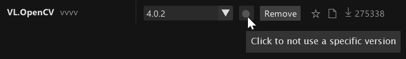

Generally this option is the default for packs that have the "Built-In" tag, as for those, the decision regarding the exact version has already been made for you.

The other situation where this is useful, is larger projects with multiple VL documents that reference the same pack. In such scenarios this feature is half of what will allow you to centrally manage the version of packs for multiple documents. The other half of the feature is still work in progress, see "What's missing" below.

## Vulnerable packs

nuget.org (the default package repository vvvv gets packs from) maintains a list of packs with [known vulnerabilities](https://learn.microsoft.com/en-us/nuget/api/vulnerability-info) present in individual packs.

When installing a pack, vvvv checks against that list and informs you in case you've chosen a vulnerable version. Keep an eye on the [Log](https://thegraybook.vvvv.org/reference/hde/debugging-log.html) when adding a pack and look out for warnings like the following, to be aware of issues:

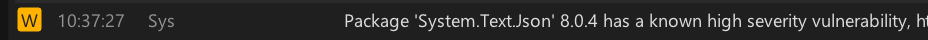

## Quick VL pack reference

The best thing about Packman is that in the end you will not even need it that much! If you already know the name of a VL pack you want to reference, you can now simply add it via the Nodebrowser. Check this: 

<video width=100% controls autoplay>
    <source src="../../images/reference/hde/packman-nfc.mp4" type="video/mp4">
    Your browser does not support the video tag.  
</video>

Type the name of any pack in the nodebrowser, select it and you're done. Any VL pack found in Packman or in the [online packs browser](https://vvvv.org/packs/) can be added like this.

Say what? What does this do exactly? Two things: 
- Downloads the preferred version (see below) of the pack
- References this version of the pack with your active VL document

Want to remove the pack again? Same trick:

<video width=100% controls autoplay>
    <source src="../../images/reference/hde/packman-nfc2.mp4" type="video/mp4">
    Your browser does not support the video tag.  
</video>

So when do you now still need Packman? 
- To search for packs
- To get more information about a VL pack
- To adjust versions for referenced packs
- To search for and reference .NET NuGets (ie. packs that are not specifically made for VL) 

## Preferred version of a pack

The question may arise: When you simply choose to add a reference of a pack via the Nodebrowser, without specifying a version, what version will you get? The answer: vvvv has an idea of a preferred version per pack and here is how that's computed:

- Start assuming the latest stable version of the pack
- Check the [package-constraints](https://github.com/vvvv/PublicContent/blob/master/package-constraints.txt) file for known limitations of the pack regarding the running version of vvvv
- Settle on the latest available stable version of a pack that is not constrained by the package-constraints

Note how this information is also visualized in the version dropdown of each pack. If vvvv is aware of any incompatibilities between a specific version of a pack and the running instance of vvvv you'll see those "Stop" sign icons, meaning those versions of the pack will not work with the current vvvversion.

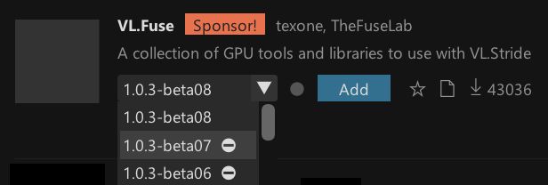

Keep in mind that the package-constraints file is edited by humans like you. So the information it provides is only as accurate as it is communaly maintained. 

## Favorites

Despite the sheer number of packs available, you may realize that often you only use the same. To give you quick access to those, we've added the idea of favorite packs. You can star packs in the Packman or Helpbrowser:

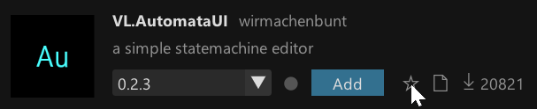

And then get quick access to those in a separate listing:

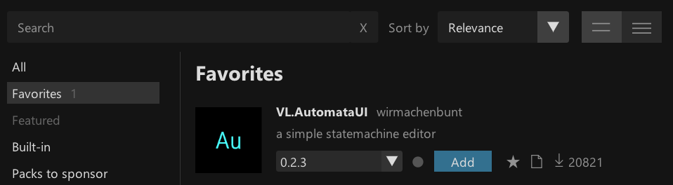

Little caveat: If you've used favorites in the Helpbrowser before, those will not be transferred to the new system automatically.

## Support developers

Also please pay extra attention to this special listing: 

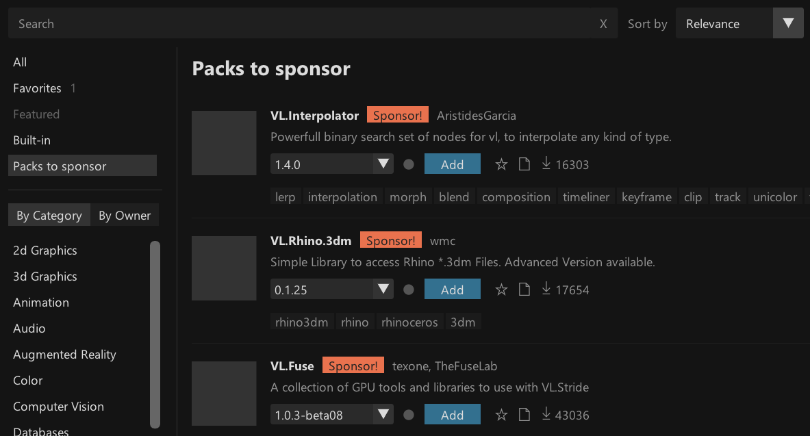

Packs don't appear out of thin air. They are made and maintained by your fellow patchers. If a pack is useful to you, please support the creator! 

## Install packs via Helpbrowser

There is more. Remember how previously you'd have to find a pack, install it and only then get access to its help patches via the Helpbrowser?

Now, when searching in the Helpbrowser, it also looks for packs that might fit you term and displays those in a separate section at the very bottom labeled "More Packs". If you find anything here, you can one-click download the pack and get instant access to its helps.

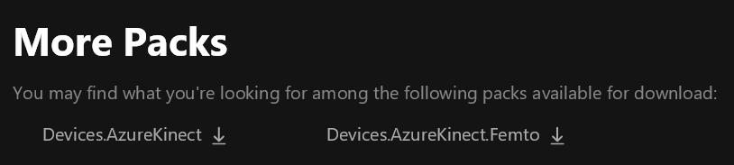

Note the difference: if you download a pack here, it is simply available offline and you can browse its help patches. It is not yet referenced with any of your documents!

Also you may wonder: The content of which packs does the Helpbrowser show at all and in what version? 

Remember: In versions <= 7.x of vvvv gamma, the packs you'd see in the Helpbrowser would always be the most recent ones found in your nuget folder.

Since that folder does not exist anymore, there are now different rules: 
- If a specific version of a pack is loaded, the Helpbrowser shows the help content of that particular version
- Otherwise, the Helpbrowser shows the content of the preferred version (see above) of the pack, but only if it is already available on your system (ie. you have had it referenced/downloaded before)