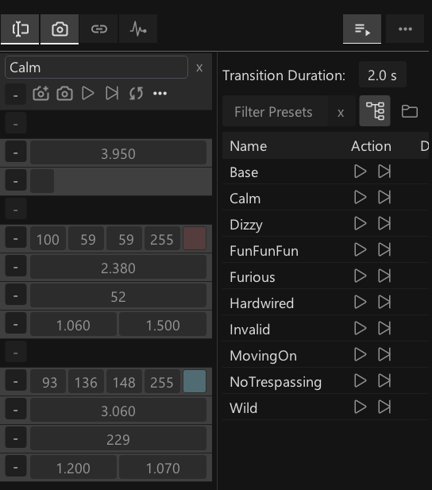
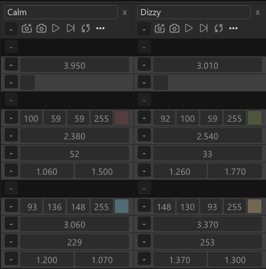
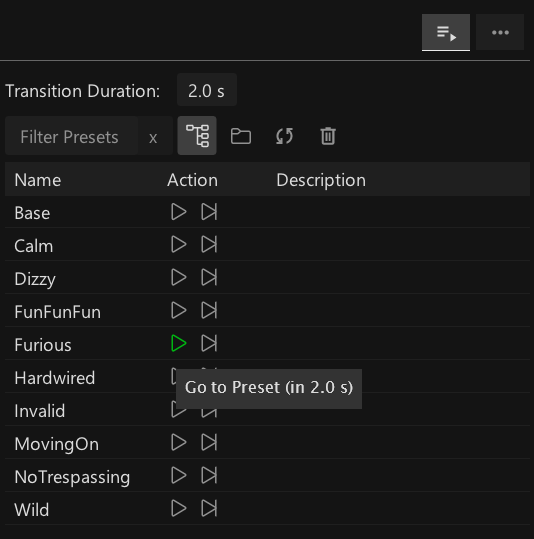

# Presets & Transitions

Using presets you can take snapshots of any combination of [Public Channels](channel-browser.md), store and recall them again anytime. A simple recall will jump to the stored value. Using a transition, values will be smoothly converged to. 

<small>A preset column to store, and the Presets Panel to trigger snapshots</small>

## Storing presets
There are two ways to store presets: 
- Via the Channel Browsers "Preset Columns"
- Via a set of nodes

<small>Multiple preset columns can be used in parallel, allowing you to capture and manipulate presets.</small>

Every preset is stored in small .xml file in a folder called "Presets" next to the main active .vl document. This allows you to re-arrange/re-name presets right in the explorer. Also this is good for version control where you get a good view on changes.

To learn about storing presets programmatically from within a patch check out the help patch of the "StorePreset" node.

## Recalling presets
There are two ways to recall presets: 
- Via the Channel Browsers "Presets Panel"
- Via a set of nodes

The Presets Panel shows a list of all available presets. Here you can quickly transition to or jump to any of the them, but also rename them, add descriptions or delete them.

Obviously, there is some more to transitions (curve, duration) you'll want to control (and you can!) but for simple scenarios the default transition should already allow for quick prototyping. 

To learn about recalling presets programmatically from within a patch, check out the help patches of the "RecallPreset" and "TriggerPreset" nodes.