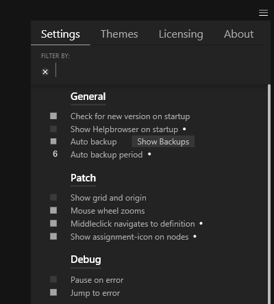

# Settings

The settings can be found in the Hamburger menu in the top right corner of the editor window:

In versions prior to 2021.4,  the settings had to be edited manually in a text file, see: `Quad > Settings`.

## Local Settings
You can also provide a local settings file via commandline options when you start up vvvv.exe:

    --settings C:\path\to\setings.xml