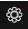
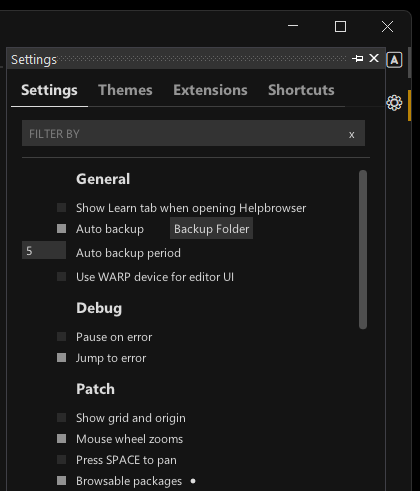

# Settings

The settings <kbd>Ctrl</kbd><kbd>F1</kbd> can be found in the  menu in the top right corner of the editor window:

## Local Settings
You can also provide a local settings file via commandline options when you start up vvvv.exe:

    --settings C:\path\to\settings.xml