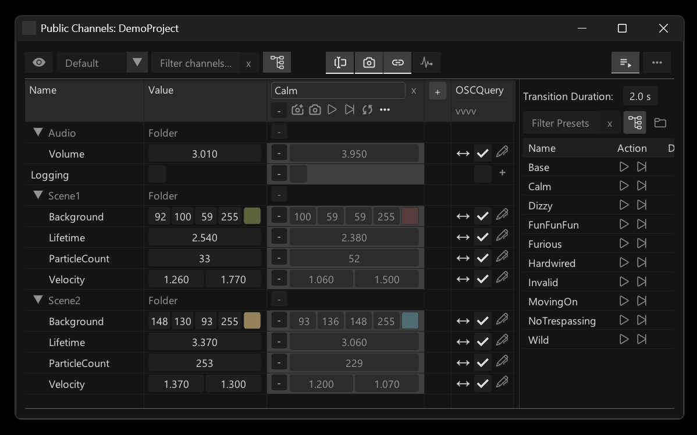
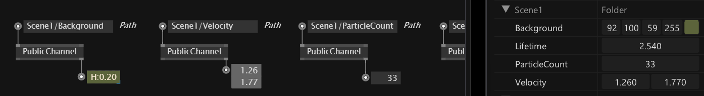
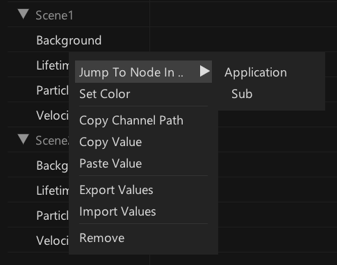
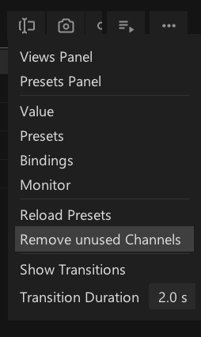

# The Channel Browser

The Channel Browser (<kbd>Ctrl</kbd><kbd>F4</kbd>) is quite a beast, full of functionality. So please take some time to explore it. But generally what it does is to give you an overview of your Public Channels, ie. all your app-wide public, named parameters.   

It lists and allows editing of all your public channels, allows you to store and re-call snapshots of their values using [Presets](presets.md) and with just a few clicks allows you to expose them to the world via the idea of [Bindings](bindings.md).

## Creating a public channel

To create a public channel use the PublicChannel node and give it a path and type. In the simplest case the path is just a name, but it can also contain slashes "/" allowing you to organize public channels in the Channel Browser.

Once defined like this, the value of a public channel can be controlled via the Channel Browser or from another PublicChannel node given the same path. And being a channel, this also means you get bi-directional ie. read/write access to it!

PublicChannel nodes can also be created in a patch by drag-dropping a channel from the browser into a patch!

## Finding PublicChannel nodes
In larger projects with many public channels it can get tricky to remember where all instances of the PublicChannel nodes are. Rigthclicking a public channel in the browser shows you all of them and lets you jump to them.

## Persistence of public channels

Definitions of channels are saved in a separate file with the same name as the active main .vl document but with the file ending ".pc". Like this, when opening a .vl document that has a sibling .pc file, you can rest assured that all public channels are available in the first frame.

Also this is great for version control where you'll see diffs of your changes to public channels in a central spot.

## Removing a public channel

When removing a PublicChannel node, the corresponding channel is *not* automatically removed. The only way to remove a public channel is via the Channel Browser: Rightclick a channel and click "Remove". If now no PublicChannel node is left referencing that channel, it will be gone.

To remove all public channels that are no longer referenced by a PublicChannel node at once, use the "Remove unused channels" entry in the Channel Browsers edit menu:

