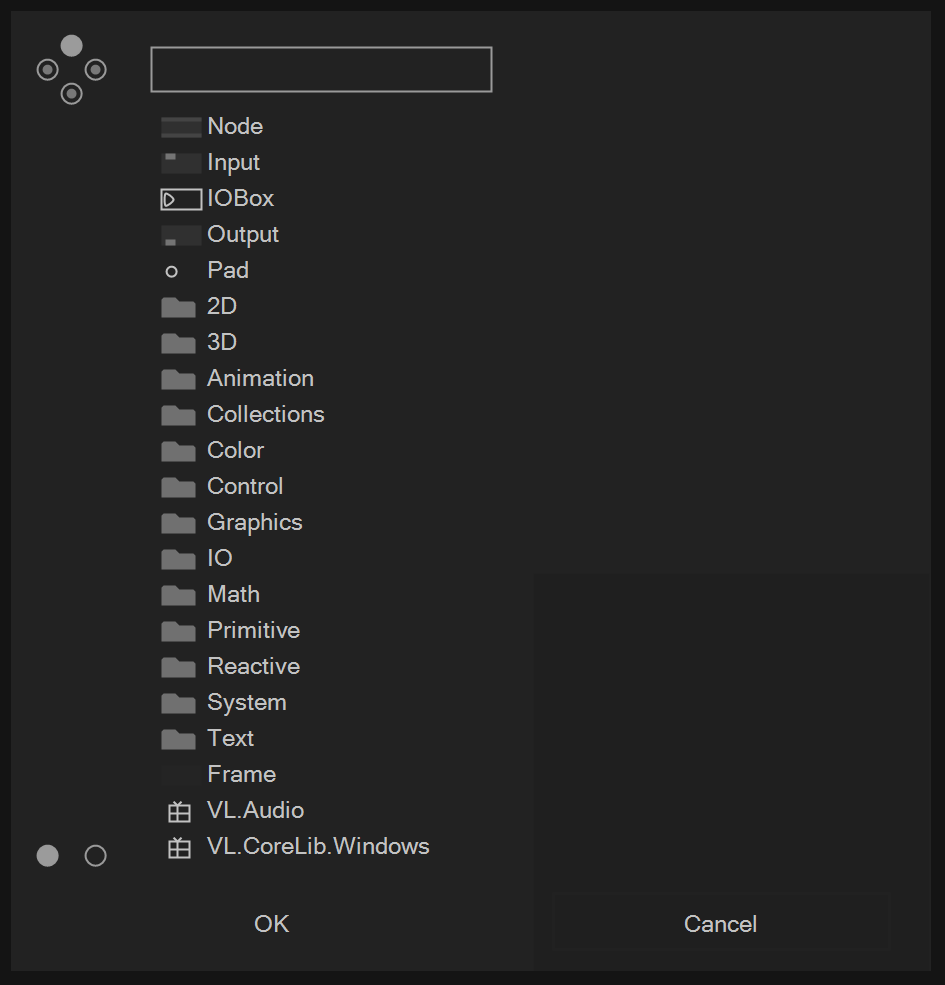
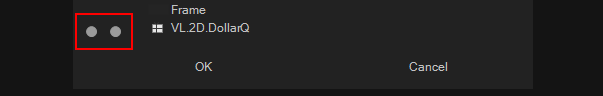
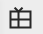
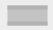
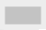
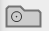
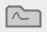
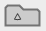
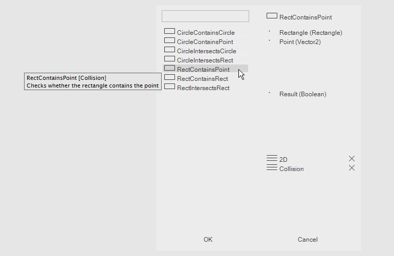
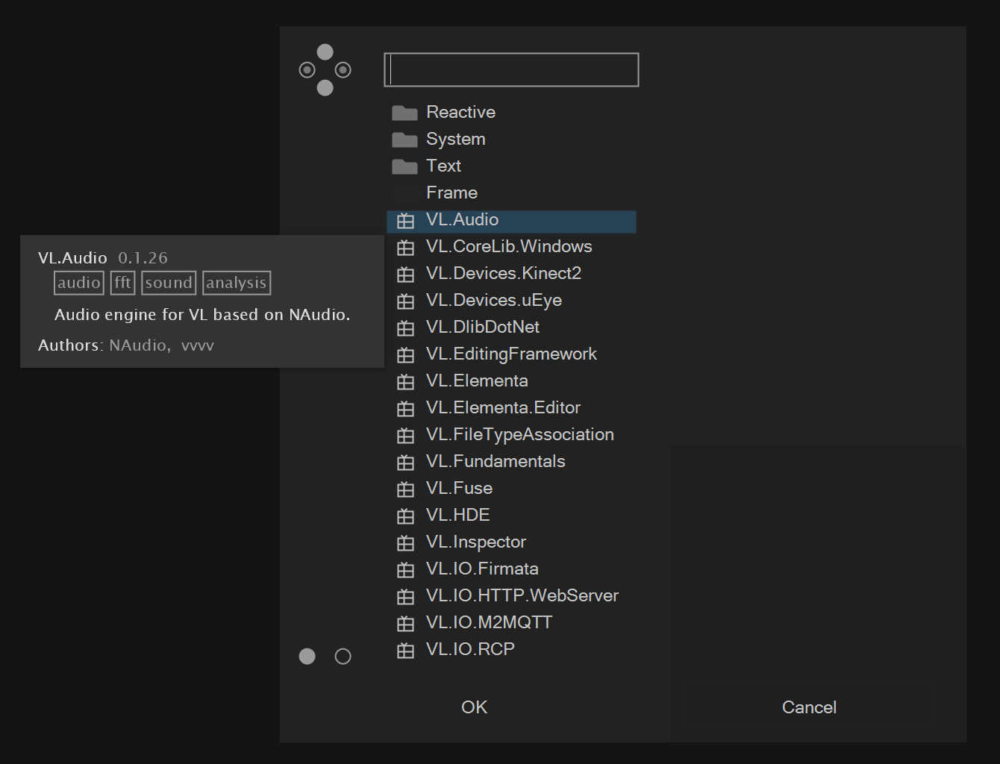

# The NodeBrowser

When opening the NodeBrowser via a left double-click anywhere on a patch what you see is:

* Language primitives (Node, Input, IOBox,...)
* A list of top-level node categories (2D, 3D, Animation,...)
* A list of available nugets (VL)

You can also bring up the NodeBrowser:

* While linking by double leftclicking to create a node that is connected to the link at hand
* By double leftclicking on an existing link to insert a node there
* By double leftclicking an existing node to replace it

## Filtering nodes

The circles on the left side are filters that let you quickly include or exclude a certain group of nodes. Hover them with the mouse to see their purpose and click to toggle them on or off:
- Include high level nodes (the standard set)
- Include potential future nodes (Experimental)
- Include low level nodes (Advanced)
- Include obsolete, old nodes (Obsolete)

The bottom two circles are two more filters:
- Include internal nodes (those that are only visible inside this document)
- Include external nodes (from referenced .dlls and NuGets)

If you see a dot inside of a circle, it means that, given the current search term you would get additional nodes listed, if this filter was on.

## Finding Nodes
There are different ways to navigate the list of available nodes:

* By category
* By tag

In both cases it helps to be familiar with the icons:

 Category

 NuGet Package

Nodes:

 Process Node

 Operation Node

Types:

 Record

 Class

 Enumeration

 Interface

Hovering any entry that represents a node will show you the nodes Inputs and Outputs in the topright corner of the NodeBrowser and a tooltip will show you the description associated with the node if available.

When you're clicking an entry that represents a node two things may happen:

* If your selection is unambiguous the node will be created
* There are situations where a selection is ambiguous in which case the NodeBrowser prompts you to specify more details by choosing from the offered options.

### Search By Category
Nodes in VL are organized in a hierarchical structure of categories. Click any of the categories to enter it.

Note that when entering a category, a tag appears in the bottom right part of the NodeBrowser. The listing is now filtered by this tag. Choose another category from the listing to refine your search or remove a tag by clicking on the X button next to it. Pressing the ESC button always removes the last tag.

### Search By Tag
Enter any word to search for it.

## Language Primitives
The language primitives are written in _italic_:

* IOBox
* Pad
* Pins (Input, Output)
* Patch Definition
* Canvas
* Record Definition
* Class Definition
* Operation Definition
* Delegate
* Regions (Repeat, Foreach, If)

Many of the primitives can be given a name directly after choosing to create them via the NodeBrowser. For Pins and Pads it also works the other way round: type a name into the NodeBrowser and then click Pin/Pad to create the respective element with already the desired name set.

## Available Nugets
Nugets that are available for VL but not referenced by the active document show up in the NodeBrowser from where you can quickly reference them via a single click. After the nuget is referenced all its nodes show up in the NodeBrowser.

If you want to get rid of a nuget again you have to uncheck it in the documents list of dependencies.

## Nodes that ony differ by Signature
We typically distinguish nodes by Name, Version or Category.
But in some cases there are several nodes that share all of the above. 
When in the process of designing the surface of a library we typically give nodes a Version to distinguish nodes that only differ by a detail, but in other cases we import nodes from a dll without naming each of the overloads differently.

In these cases the user needs to select the node by choosing a signature:

We have two modes to let the user select the node:
* select the node signature. This is like choosing several pins at once.
* select single pins in a multiple choice fashion

This is how it looks when choosing the node:
In our case we see three entries corresponding to the three available nodes:

This is how the worflow for choosing single pins works:
* If there is a node that is clearly simper than all others in terms of its signature, this node will get created.
* Double-clicking on the node will show you pins that you can opt-into
* Selecting such a pin will again close the node browser if there is one node that is clearly simpler than any other with that pin configuration.
* Double-clicking the node will allow you to see if there are more pins that you could add, and which pins you already committed to. You can cancel pin choices individually in order to find the overload you need.
This workflow can be helpful in cases where many overloads with many pins show up. You don't need to keep track of all the different variations. Just tell the node browser which pins you want to work with and you'll be presented pins that are still an option.

Activate this workflow by choosing

