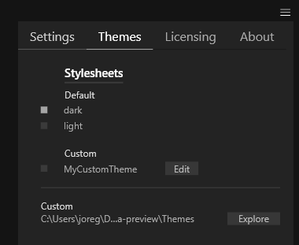

# Themes

The vvvv editor supports theming. You can quickly switch between a dark and light theme via the Hamburger menu in the top right corner:

Additionally you can create custom themes using (a limited set of) [CSS](https://de.wikipedia.org/wiki/Cascading_Style_Sheets). Copy one of the provided themes and start modifying from there. Place custom themes in your user document folder to have them picked up:

`...\Documents\vvvv\gamma\Themes`