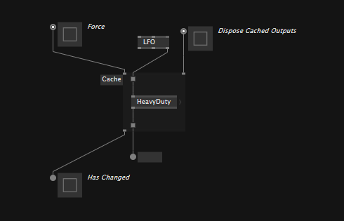

# The Cache region

To prevent parts of a patch being executed every frame, you can use a `Cache` region. The number one use-case for Cache regions is optimizing performance by making sure things only get executed when they really need to, thus saving precious CPU cycles.

All nodes inside a Cache region are only executed if one of its border control inputs is changed or its `Force` input is set to true.

Once executed, the regions output border control points hold (ie. cache) the results until the region is executed again. 

The `Dispose Cached Outputs` input defines whether objects, cached in one of the regions output border control points, will be disposed, before a new result is being cached. This is only necessary for unmanaged objects. As a rule of thumb: If the objects class has a Dispose() method, you'll most likely want to activate this input, except you're intentionally dealing with its disposal in a different way. 

The `Has Changed` output returns true for every frame the the region was executed.

You can quickly surround a bunch of nodes with a Cache region, by selecting them and then choosing `Surround -> Cache` from the rightclick context menu.

Moving nodes into and out of the region works by pressing `Space` while dragging them. 