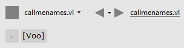
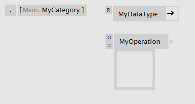

# Categories

Categories in VL are synonymous to "namespaces" in other programming languages. They allow you to structure your libraries of nodes. 

## A documents category
Every VL document starts a category which can be defined in its Definitions Patch. 

"Voo" specified as a documents category

## Category elements
Category elements can be added to the [Definitions Patch](patches.md#definitions-patch) via the NodeBrowser by choosing "Category", to build a category structure that holds different parts of a library. 

A categories name appends itself to the category of its parent patch. That way you can build up any category hierarchy, that you then see in the NodeBrowser. Multiple category levels are allowed with dot notation. e.g. _MyCat1.MyCat2_ etc.

Category patch from the outside

Inside a category patch

## Full Category
A Full Category is similar to a normal Category, only that it doesn't add its category to the parent but starts a new root category. 

Category patch from the outside

Inside a category patch

> [!NOTE]
> Empty categories are not showing-up in the NodeBrowser.

## Changing the Patch Type
You can easily convert a category into a [Group](groups.md) patch and vice versa using the patch type enum. Note how the label changes and represents the actual category structure:

Converting a group into a category

## Setting Categories on Definitions
As if the above didn't offer enough options already there is one more way to specify a category for an operation or a datatype definition:

Setting a Category on an datatype or operation definition

