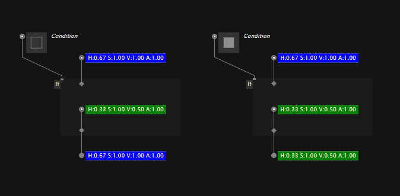
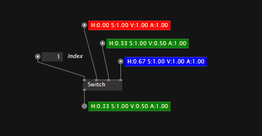

# Conditions

At this point, the only conditional language primitive in VL is the ``If`` region.

## The If region

The If region can be used to conditionally execute parts of a patch. If the ``Condition`` input is set to true, then the patch inside the region is executed, otherwise the values on its border control inputs are passed through to their corresponding outputs. 

You can quickly surround a bunch of nodes with an If region, by selecting them and then choosing ``Surround -> If`` from the rightclick context menu.

Moving nodes into and out of the region works by pressing ``Space`` while dragging them. 

## Switch

While there is no dedicated Switch region, there is a Switch node that at least lets you route multiple potential inputs to one output, depending on a condition or index.

The Switch node has a pingroup for its inputs. Select it and press <kbd>Ctrl</kbd><kbd>+</kbd> or <kbd>Ctrl</kbd><kbd>-</kbd> to add/remove inputs.