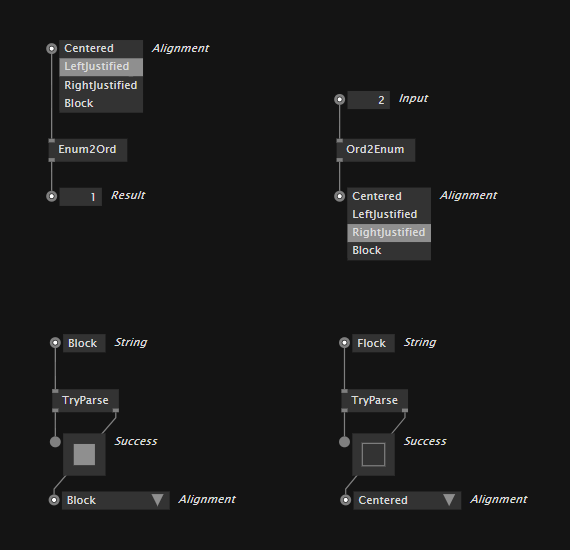
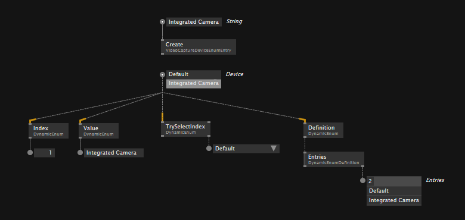

# Enumerations

An enumeration type (or enum type) is a value type defined by a set of named constants. VL has two different types of enumerations: 
- Static Enums
- Dynamic Enums

## Static Enums
Entries of a static enum are fixed and cannot change at runtime. An example would be the type `LinearSpreadAlignment`.

### Using Static Enums
For working with static enums, use nodes from the `Primitive.Enum` category. 



### Defining Static Enums
As of now static enums cannot be created in VL itself. Instead you have to create a small C# code snippet that defines the enum. Follow the instructions unter [writing nodes](../extending/writing-nodes.md) and choose the "Static Enum" template. Opening the .cs file the template created, you'll see the following line:

```csharp
    public enum StaticEnum { foo, bar };
```

You can customize this line to your needs, like e.g: 

```csharp
    public enum MyEnum { a, b, c };
```

Saving the .cs file will make the enum available in your VL document. 

## Dynamic Enums
A dynamic enum can have entries added, removed or changed during runtime. They are used for example for device enumerations. 

### Using Dynamic Enums
For working with dynamic enums, use nodes from the (advanced) `Primitive.DynamicEnum` and `Primitive.DynamicEnumDefinition` category.



### Defining Dynamic Enums
As of now dynamic enums cannot be created in VL itself. Instead you have to create a small C# code snippet that defines the enum. Follow the instructions unter [writing nodes](../extending/writing-nodes.md) and choose one of the "Dynamic Enum" templates. Opening the .cs file the template created, you can customize the template. 

For more details on this customization, see: [Defining Dynamic Enums](../extending/writing-nodes.md#dynamic-enums).

After your changes, saving the .cs file will make the enum available in your VL document.
