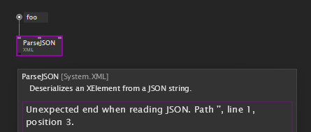
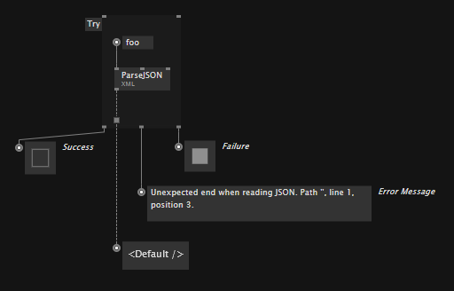

# Exception Handling

Nodes sometimes get a pink border, which means that they are throwing a runtime error. Hovering the node with the tooltip will show you more information about the error:

Depending on your [Setting](../hde/settings.md) for "Pause on Error" the execution of your patch will either pause or continue. But even if the execution continues it may fail again at the same spot at a later time. Therefore it is good practise, to "handle" exceptions. 

In order to handle runtime errors programmatically, you can surround the culprit with a Try region:

This will allow you to react to problems in your patch gracefully without interrupting the execution of your program. 