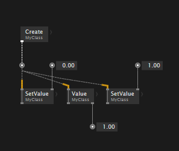
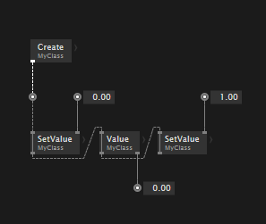
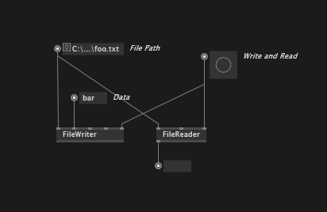
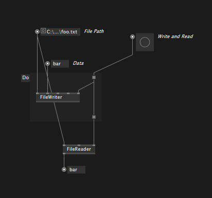
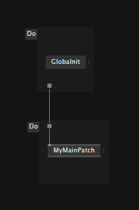
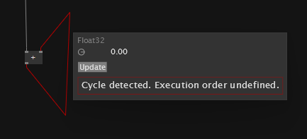
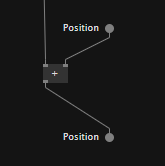

# Execution Order

In most cases the order of execution of nodes is obvious: From top to bottom, in the order they are connected with each other through links. 

## No link dependency
There are cases though, where there is no link dependency between nodes that would express an order of execution. This may be fine or not, depending on your use case. Here are some cases where this may matter and how to solve them:

### Multiple writes to mutable data

When writing to (ie modifying) a mutable datatype several times in one frame, execution order typically matters. In this example the Value is read but the fact that it is reading "1.00" for this frame is not defined, it could be "0.00" as well, since there is no order defined. This is also what the "yellow socks" warning on the links is about.

Instead of connecting the operations to the pad "in parallel", connect them "in series", and thus specifying a well defined order of execution. 

### Nodes with no connection in the patch

If you want to write data to a file and read it in the same frame, you need to make sure to write before you read. A naive patch like this, wouldn't make sure of this and thus might randomly work, or not:

In order to create links between nodes in such situations, you can use the `Do` region. The region itself does nothing but letting you create input and outputs for it so you can use those to define an order of execution.

### Nodes without any pins

There are cases of nodes that don't have any pins at all. Often those are operations to globally initialize the state of a library, in which case it is important to have them execute before anything else. In those situations a `Do` region can help you build an order of execution, like so:

## Circular graphs

When trying to make a circular link connection, VL will prevent you from doing so. If you force the link by pressing <kbd>Space</kbd> while making the connection, you'll see an error like this:

Think about it: If VL would allow you to do this, it would never know where to start the execution. Therefore in such situations you need to find out where to best store the value of a computation from a previous frame and use it in the next frame. 

To solve this, introduce a [Property](properties.md) and use Pads to write a value in one frame and read it in the next frame:

