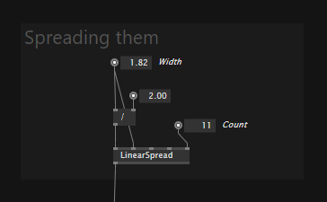
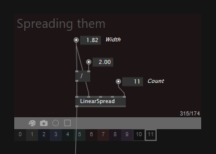

# Frames

Frames help you structure your patches visually. You can put a frame behind parts of your patch and give it a title and color.

For an overview of all keyboard shortcuts related to frames, see [Frame Shortcuts](../hde/keyboard-shortcuts.md#Frames).

When selected, the frame can be tinted using one of the predefined colors:

You can move a frame around without its content, by dragging the gray bar (when selected). To move a frame and its content, drag it on its title.

## Screenshots

Besides being structural elements, frames also allow you to take screenshots easily and repeatably:

* Press the Printer button to make a screenshot, then rightclick it to see the captured file in explorer
* Alternatively press <kbd>Ctrl</kbd><kbd>2</kbd> to take a shot of the selected frame
* Press <kbd>Ctrl</kbd><kbd>5</kbd> to take screenshots of all frames in a document at once

To create a quick screenshot of an area without even creating a frame, simply press <kbd>S</kbd> while making a selection. This will copy the screenshot to the clipboard (so you can simply paste it into the chat or a forum reply) and also place a .png next to the current .vl document.

## Recordings

Apart from single screenshots you can also record an animated gif of the area of a frame:

* Press the Record button to start a recording, the same button again or <kbd>Esc</kbd> to stop it, then rightclick it to see the recorded file in explorer
* Alternatively toggle <kbd>Ctrl</kbd><kbd>4</kbd> to start/stop recording the selected frame