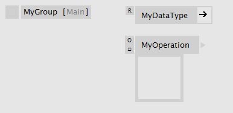

# Groups

A group allows to make extra space on a patch by hiding elements away in a new canvas. Groups have a name, but these are merely used for human readability and have no meaning for VL.

Create a group by typing "group" in the NodeBrowser. Groups can also be nested.

Inside a group patch

Group patch from the outside

A group can easily be converted to a [Categry](categories.md):

Converting a group into a category
