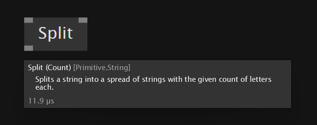

# Nodes

Nodes are the main building blocks of a patch. They have input Pins at the top and output Pins at the bottom. Pins are the hubs that allow Nodes to be connected via [Links](links.md). 

Nodes are also referred to as the "application" of a node definition.

## Node Name
A nodes name consists of the following components: 
- Its display name
- An optional version
- Its category (think namespace)

Hovering a node to view its tooltip shows its full name:

The node "Split" of version "Count" in the category "Primitive.String"

## Types of Nodes
There are different types of nodes:

*Image: Process node, Static Operation node, record operation node, class operation node*

### Process Nodes
A process node represents a single instance of a patch. 

The name _Process_ comes from the fact that it can be understood like a little machine that does some initialization routine (the `Create` operation) once it is first executed and then continues to execute one or more of its operations in a loop, maintaining an inner state from one frame to the next. Typically, a Process node has at least an `Update` operation, but it is not limited to that. 

Process nodes have a distinguished look with the bars behind their pins being darker. This makes them visually heavier, hinting at the fact that they are holding state, ie. storing data between consecutive executions.

For more on defining Process Nodes, see [Datatype Patches](patches.md#process).

### Static Operation Nodes
Operation nodes are nodes representing a single operation.

They have a lighter look than Process Nodes, with the bars behind their pins not being visible. This indicates that they are not operating on a state, ie. they do not store any data between consecutive executions.

#### Apply input
If the first input and first output of a static operation node share the same datatype, they can have an _Apply_ pin added via `context-menu > Configure`. 

The Apply input defaults to true. When disabled, the operation is bypassed and the input returned unchanged as the output.

This is essentially a shortcut to surrounding the node with an [If Region](conditions.md#the-if-region).

### Record Operation Nodes

Record operation nodes are part of a record, on which they operate. They are visually higher, as they also display the name of the datatype they belong to in smaller type, below the nodes name. 

They have an optional "State Output" pin that is visually not connected to the corresponding "State Input" pin, indicating that the object going out is always a completely new object, cloned and modified from the incoming object.  

### Class Operation Nodes

Record operation nodes are part of a record, on which they operate. They are visually higher, as they also display the name of the datatype they belong to in smaller type, below the nodes name.

They always have a "State Output" pin that is visually connected to the corresponding "State Input" pin, indicating that the object coming in is the same as the object going out, only modified. 

## Optional Pins on Nodes

Nodes can have Pins that are not visible by default. Rightclick a Node and press Configure to show a little inspector that allows you to show/hide optional Pins.

## Pin groups

Some Nodes have Pin groups, which allow you to change their number of pins. 

Examples of nodes with Pin groups:
Group, Cons, +

Typically a Node has either a single input or output Pin group, in which case it pins can be added/removed by pressing <kbd>CTRL</kbd><kbd>+</kbd> or <kbd>CTRL</kbd><kbd>-</kbd> respectively.

For keyboard shortcuts in case of multiple Pin groups on a node, see:  [Pin group shortcuts](../hde/keyboard-shortcuts.md#pin-groups).

## Navigating to a Nodes definition

If a node is defined by a patch, you can navigate to its definition via pressing  `RightClick -> Open` on the node. Any node that spots an arrow icon has a patch behind in the same document or a document that is directly referenced as a file dependency. This patch can quickly be opened via middle-clicking the Node. 

*Image:Node with a patch behind it*

See also the [setting](../hde/settings.md) "Middleclick navigates to definition" to enable the middleclick to navigate to any patch even if it is not in the same or a referenced document. 

If a node is defined by SDSL shader code, the corresponding code editor will open. See [Editing Shaders](../libraries/3d/editing-shaders.md). 

Nodes that are defined by C# code cannot be inspected. 