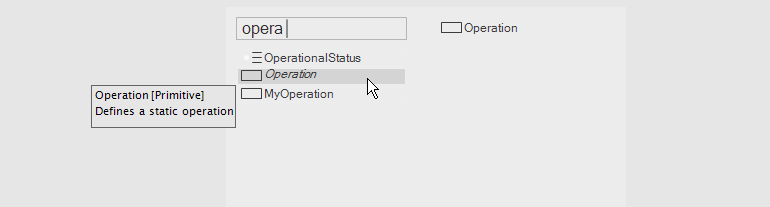
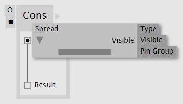

# Operations

Operations define a simple functionality. They take input, do something with it and return a result. Operations cannot hold state, meaning they cannot store any data between consecutive calls. Data instead is stored in [Properties](properties.md). 

## Definition vs. Application

Using the term "operation" alone can be ambiguous if not from the context it will be clear whether we actually mean an "operation definition" or an "application of the operation definition" which again is synonymous with "node". In this chapter, we're using the term "operation" as shortcut for "operation definition". 

## Types of Operations

There are two different types of operations in vl:

* Member operations
* Static operations

## Member Operations
The term _member_ refers to the fact that those operations belong to and operate on the data of a datatype.

Datatypes can have many operations, most often they have at least a `Create` and an `Update` operation. To distinguish multiple member operations in a patch, VL uses colors for Pins and Links. There are three reserved colors: 
- White: for the Create operation
- Gray: for the Update operation
- Dark red: for the Dispose operation

All other colors are applied randomly from a color pallette and have no meaning whatsoever. They are only there to indicate the belonging of colored elements to a certain operation. To check which color refers to which operation, use the [Patch Explorer](../hde/patch-explorer.md) or hover the pin and find the operation mentioned in the tooltip.  

*Image:A member operation definition and its application as a node*

### Creating a Member Operation
Member operations are either created via the [Patch Explorer](../hde/patch-explorer.md), or during the assignment workflow, where you can choose to assign to a new operation and then specify the name of the operation to be created and assigned to at the same time.

### Assigning Nodes, Inputs/Outputs and Links to operations

Use the elements context menu to assign it to one of the available operations or create a new one. 

Often it makes sense to start assignments on Input or Output pins. Note that assignments auto-propagate through the whole patch. They only stop at Pads or Process Nodes, which act kind of like bridges between the operations in that they store values written by one operation and have them available for retrieval by an other operation. 

There are cases though where no Input or Output pin is part of an operation. In that case consider setting an assignment onto a link or Operation Node.

> [!NOTE]
> Process Nodes cannot be assigned to an operation. Instead you'll see that their Pins can assign to different operations, meaning that different parts (operations) of a Process Node can be executed on different operations in the containing patch. 

### Clearing Operation assignments

To remove the assignment from an element, also use the context menu -> Clear assignment. 

By default, elements with no assignment will "fall back" to being executed on Update, if it is available. 

### The Dispose Operation

In cases where you deal with an unmanaged object it is necessary to add an operation named `Dispose` and use it to in turn execute a Dispose node for the object. This will make sure that when the parent patch is disposed, that the managed resource will be disposed as well. 

Since there is no way to know whether an object is unmanaged, a simple test you can do, is try to connect Dispose [IDisposable] to an instance of it. If this connection is allowed, you know that the resource is unmanaged and needs you to manually call Dispose on it.

## Static Operations
Static operations are on their own, operating only on data they are being fed with.

*Image:A static operation definition and its application as a node*

### Creating a Static Operation
Static operation definitions can be created via the NodeBrowser.

Choose to create an operation definition in the NodeBrowser

By default, static operations have their _Is Generic_ property set to false. Errors will be shown for all inputs and outputs of the operation whose datatype is not specified or cannot be infered. To allow generic inputs, enable this toggle.

The "Is Generic" toggle of an operation definition is off by default

Once created, the operation definition shows up in the NodeBrowser and can now be created as a node.

The newly created operation can now be selected via the NodeBrowser

## Input and Output Pins
Inputs and Outputs in operation definitions show up as Pins on the corresponding Node.

There are two ways of creating pins:
- With a link at hand, hold <kbd>CTRL</kbd> while left-clicking
- Doubleclick to bring up the NodeBrowser, then type the name, you want the pin to have, then choose either `Input` or `Output`

### Configuring Input and Output Pins
Use a pins configuration menu to to configure it. You can reach the menu either way:
- Middleclick the pin
- Rightclick the pin and choose `Configure`

#### Annotating Inputs and Outputs
"Annotating" means to manually specify a datatype for a pin. In the configuration menu, the topmost entry allows you to specify a Type. Doubleclick the entry to edit it. 

> [!NOTE]
> Type names are case-sensitive, ie it is important that you're using correct spelling when setting a type.

#### Defaults for Inputs
When an input is annotated with a type you can also specify a default for it in the configuration menu. 

#### Visibility for Inputs and Outputs
As the creator of a node you can also decide if certain pins should not be visible by default. A reason to do so would be that the pin is of rather special interest and default usage of the node doesn't require it. 

When setting a pins visibility to `Optional` it can be shown by a user of the node, using the nodes configuration menu. If a pin is set to `Hidden` it cannot be used by a user of the node. 

#### Pin groups
Pins of type Spread can also be changed to a so called _Pin Group_. Pin Groups allow you to dynamically add/remove pins to a node. For the keyboard shortcut to do so, see [Pin Group Shortcuts](../hde/keyboard-shortcuts.md#pin-groups).

In order to make a pin into a pin group, it has to be annotated to the type `Spread`. Then you can set the Pin Group flag in the configuration menu to TRUE.

### Operation Signature
The signature of an operation allows you to define the order in which its Inputs and Outputs show up on corresponding nodes.

For static operations the signature can be opened directly on the operation definition region. The signature of member operations can be accessed via the PatchExplorer.

*Image:Signature of member operations in the [Patch Explorer](patch-explorer.md)*

*Image:Signature of a static operation*

By default the order of pins is defined by their left-to-right placement in the patch. To override that behavior uncheck the "pin order" toggle and arrange the pins by drag-dropping them directly in the signature.

Doubleclicking a pins name allows you to rename it. A middleclick on a pin allows you to annotate it with a type.
