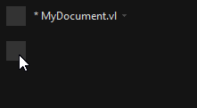
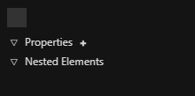
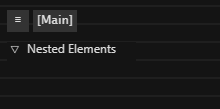
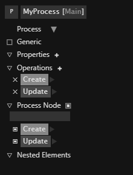
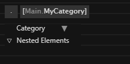

# The Patch Explorer

Gives a quick overview of elements in a patch and allows to configure the patch name and type and further properties depending on the type. 

## Showing and Hiding the Explorer
By default the patch explorer is not showing. It's visibilty can be toggled by clicking the lower of the two Quad icons in the top left corner of the editor:

Depending on the type of patch, the explorer shows the relevant information:

## Application Patch Explorer

- Does not allow to specify a name
- Lists all [Properties](../language/properties.md) of the patch and allows to add/remove them
- Lists additional nested elements, like [Datatype Patch definitions](../language/patches.md#datatype-patches) and [Static Operation definitions](../language/operations.md#creating-a-static-operation)

## Definition Patch Explorer

- Allows to specify a Category which is applied to all elements in the document
- Lists nested elements, like [Datatype Patch definitions](../language/patches.md#datatype-patches) and [Static Operation definitions](../language/operations.md#creating-a-static-operation) and [Categories](../language/categories.md)

## Datatype Patch Explorer
### Process/Record/Class

- Allows to specify the datatypes name
- Allows to set the type of [datatype patch](../language/patches.md#datatype-patches)
- For types Record/Class only: Allows to specify an [Aspect](../extending/aspects.md)
- Allows to specify whether the datatype can have generic inputs/outputs
- For types Record/Class only: Lists all Interfaces and allows to add/remove them
- Lists all [Properties](../language/properties.md) of the type and allows to add/rename/remove them
- Lists all [Member Operations](../language/operations.md#member-operations) of the type and allows to add/rename/remove them
  - On each operation the [Signature](../language/operations.md#operation-signature) can be shown and manipulated
- Allows to configure the [Process](../language/patches.md#process) Definition
  - Enable/Disable the Process 
  - Set an [Aspect](../extending/aspects.md)
  - Enable/Disable the State Output
  - Define which operations are part of the Process by toggling their checkbox 
  - Define the order of operations in the Process by dragging the operations up/down
- Lists nested elements, like [Datatype Patch definitions](../language/patches.md#datatype-patches) and [Static Operation definitions](../language/operations.md#creating-a-static-operation)

### Interface
Not officially supported yet.

### Forward
See [Forwarding .NET Libraries](../extending/forwarding.md).

## Category Patch Explorer

- Allows to specify a name for the [Category](../language/categories.md) or [Group](../language/groups.md)
- Allows to change the type of [Category](../language/categories.md)
- Lists nested elements, like [Datatype Patch definitions](../language/patches.md#datatype-patches) and [Static Operation definitions](../language/operations.md#creating-a-static-operation) and [Categories](../language/categories.md)
