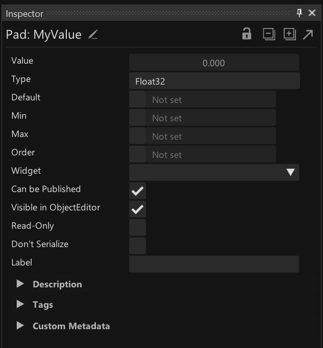

# Properties

Datatypes can use properties to store data. You can get an overview of the properties of a datatype via the [Patch Explorer](patch-explorer.md). 

*Image:Properties listed in the PatchExplorer*

You can add and remove properties via the [Patch Explorer](patch-explorer.md), but specifically for adding properties, you'd often simply create Pads.

If you're coming from textual programming, you may also think of properties as "variables" with the caveat that they can only be written to once per operation!

## Pads

In a patch, Pads are used to get (read data from) or set (write data to) properties. Pads refer to properties via name, meaning all Pads with the same name refer to one and the same property. Names are case-sensitive!

In every [operation](operations.md) you can assume that first always all Pads are read from. Then all its operations are executed and only as the last step all Pads are written to. 

If a link goes into a Pad (from above), data is written into this Pad. If a link leaves a Pad (at the bottom), data is read from this Pad.

Pads can have multiple links coming in and/or going out. Note though, that while multiple links can go out on the same operation, all incoming links need to be on different operations! Think about it this way: Pads cannot be used to store intermediate values during the execution of an operation. They can only be used to store data between the execution of different operations.

A little triangle above a Pad is a hint that there is a Pad with the same name in the patch that is also written to.

*Image:Different operations writing to the same Pad*

### Adding Pads
You can add Pads via [Nodebrowser](../hde/the_nodebrowser.md) in three different ways:

1) Enter the name of the Pad you want to create and then choose the entry `Pad`.
2) Choose the entry `Pad` and then enter a name
3) Choose from the list of existing properties that are listed in the Nodebrowser

### Renaming Pads
Doubleclick a Pad's name to change it. When renaming a Pad, only this one instance is renamed and eventually referring to a different property. If a property with the new name of a Pad did not exist so far, a new property is automatically added at this point!

To rename all Pads that share a name at the same time, rename the property via the [Patch Explorer](patch-explorer.md) instead. 

### Anonymous Pads
Pads without a name are called "anonymous Pads". They don't refer to a property but still allow you to store data between the call of multiple operations.

You can quickly insert an anonymous Pad into a link, by pressing <kbd>Shift</kbd> while doubleclicking the link.

You can also use anonymous Pads simply as a hub to join many links into one.

*Image:Anonymous Pad use as a hub for multiple links*

## The datatype of a property
A property's datatype can either be:

1) Generic
2) Inferred 
3) Annotated
   
ad 1) Generic
By default properties are generic, meaning they don't have a datatype assigned. On Pads this is visible when they are only showing the outline of a circle. 

Properties are generic as long as none of their associated Pads are have a datatype either inferred or annotated. 

ad 2) Inferred
If the compiler has inferred a type for a Pad from the links that are connected to it, it is showing as a filled circle. You can see the inferred datatype in the Pad's tooltip by hovering it.

*Image:Generic Pad vs. Pad with a datatype inferred*

ad 3) Annotated
To set the type for a property manually, you can annotate one of its Pads. Middleclick a Pad to open a little inspector where you can edit its type. As an alternative to the middleclick you can rightclick the Pad's label and choose -> Configure.

*Image:Annotating a Pad*

You can recognize Pads that are annotated manually as they have a dot in their circle.

*Image:Annotated Pad*

## Pads vs. IOBoxes
A Pad and an IOBox are essentially the same thing: While the IOBox has a value editor and a comment (on its right side), a Pad has a name (on its left side). 

You can convert between the two via Rightclick -> Replace...

You can also enable the value editor for any Pad or hide it for any IOBox.

## Metadata 
A property can have metadata associated that adds more info to it. As an example a property of type Float32 may have Min and Max values associated that allow a UI that controls that property to constrain e.g. a slider between those two values.

Metadata can be useful for different systems looking at properties. Currently the following systems take metadata into account:
- The Object Editor: See "HowTo Build a Custom Editor" in the [Help Browser](../hde/findinghelp.md)
- The Channel Browser
- Channel Bindings

To define metadata for a property, it needs to be viewed via the [Inspector](../hde/inspector.md) by selecting a Pad that refers to it.

To read metadata programmatically, see "HowTo Reflect over Property Metadata" in the [Help Browser](../hde/findinghelp.md)

<small>A property of type Float32 as seen in the Inspector.</small>

### Common Metadata
- Default: A value a UI can use to reset to 
Some metadata is available for all types:
- Order: The order in which this property would appear in a list compared to its siblings
- Widget: The type of widget the property would preferrably be manipulated with
- Can be Published: Whether or not the property can be published as a Channel
- Visible in ObjectEditor: Whether or not the property is visible in the ObjectEditor
- Read-Only: Whether the property can be only read or also written to
- Don't Serialize:
- Label: A human readable identifier 
- Description: A longer description for the property
- Tags: A list of terms associated with the property 

### Metadata specific for number types
- Min: Lowest allowed value (inclusive)
- Max: Highest allowed value (inclusive)

### Custom Metadata
Allows to assign custom key/value data to properties.