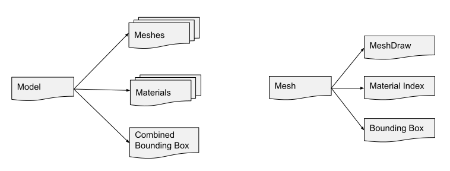
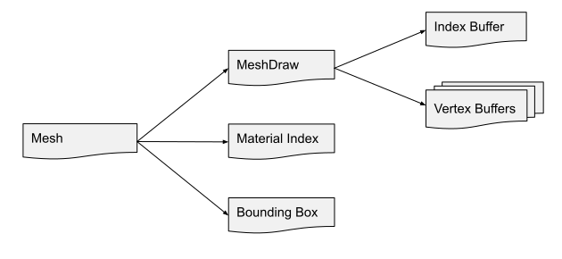

# Models and Meshes

## Model
A `Model` is a high-level class that combines geometry (meshes) with appearance (materials) and optionally a skeleton for animation. This makes it possible to represent a simple model with just one mesh and one material or a complex 3d object, such as an animated character.

To render a model, it has to be assigned to a `ModelComponent` that is part of an `Entity` in the scene graph. See [Rendering](rendering.md).

<i>Model data structure</i>

 

To join the data of a model you can use the node `MeshModel` for the simple case of one mesh and one material or `MeshesModel` for multiple meshes and materials.
## Mesh
A `Mesh` is a part of the model that contains the geometry information and an index that points to a material in the material list of the model.

<i>Mesh data structure</i>

 

The actual geometry data is stored in a class called `MeshDraw`, it holds the GPU resources for the index and vertex buffers that will be used to draw the geometry. In detail, the `MeshDraw` has `IndexBufferBinding` and `VertexBufferBinding` properties that hold the respective buffer plus some information for the graphics pipeline. So the full path from model to vertex buffer is: `Model.Meshes.GetItem[0].Draw.VertexBuffers.GetItem[0].Buffer`

### Dynamic Mesh
The nodes `DynamicMesh` or `DynamicMesh (Indexed)` create a mesh from vertex and/or index data.

## Convenience nodes
For simple setups you can use the nodes `ModelEntity` or `MeshEntity` that interally do all the entity and component setup for you.