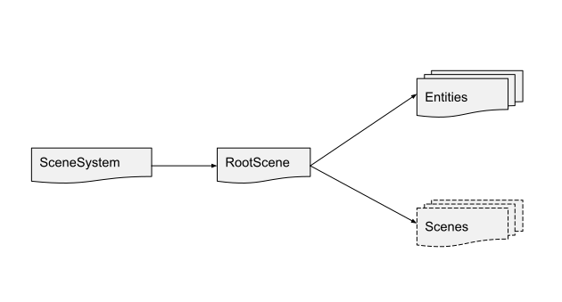
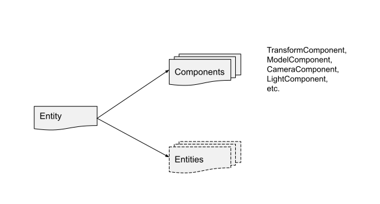

# Rendering
VL.Stride offers two workflows for rendering:
* **High-level**: Work with models, lights, materials, textures (Entity-Component-System)
* **Low-level**: Work with shaders, geometry, and GPU resources directly

If you worked with a game engine before, then you've used the high-level approach. If you're coming from vvvv beta and you worked with DX9/DX11, then you've been using the low-level approach.

Both workflows can be combined without any drawbacks, and both can render into a texture or an output window.

## High-level (scene graph)
Commonly known as entity-component-system (ECS). The scene graph consists of a tree of scenes that have entities.

<i>Scene graph data structure</i>

 

Each entity has a list of components that define the behavior and functionality of the entity. An entity can also have a list of child entities.

<i>Entity data structure</i>

 

To build the scene graph we can use the Group [Stride] nodes.

### Lights
help patches
https://doc.stride3d.net/latest/en/manual/graphics/lights-and-shadows/index.html

### Post Effects
help patches
https://doc.stride3d.net/latest/en/manual/graphics/post-effects/index.html

## Low-level (custom rendering)
It takes more effort to use because you need to know about shaders, but it allows you to do anything with the graphics API.

[Stride Low-Level API doc](https://doc.stride3d.net/latest/en/manual/graphics/low-level-api/index.html)

### Embedding custom rendering into the scene graph
Use a RenderEntiy and optionally Group [Stride.Rendering] to connect more than one renderer.

