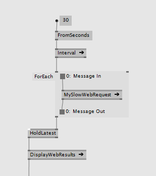
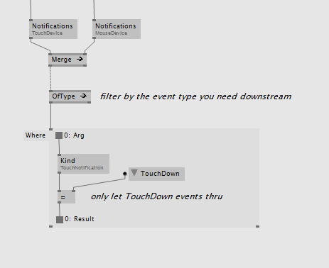
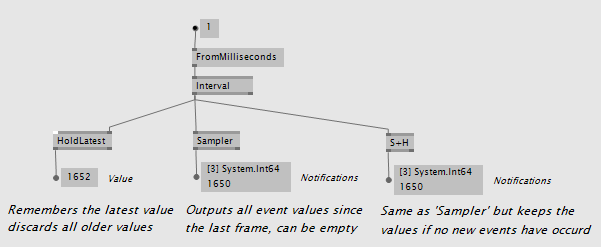

# Reactive

The Reactive category gives you tools to handle asynchronous events, background calculations and even enables you to build your own mainloop that runs on a different CPU core.

## Processing Events
The go to node for handling events is the _ForEach Region_ in the category _Reactive_. This region allows you to place any node inside and can also remember any data between two events. There is also one with version _Keep_ that can filter out events using a boolean output. This region is very similar to the ForEach region for spreads, only that its input and output is event values in time instead of slices of a spread.

Refresh web data every 30 seconds in the background and pass the result on to the mainloop

### Switching or merging event sources

Switching or merging midi events

### Filtering

There are also filtering options with _OfType_ or _Where_:

Only get TouchDown events from a combined event stream

  
Other nodes include

* Skip,
* Delay,
* Delay (Selector),
* Scan,
* Switch, ...

## Receiving Events

If you want to leave the observable world and pass event values to the mainloop use one of the 3 nodes

* HoldLatest: Returns always the latest value
* Sampler: Returns all event values since the last frame, can be empty
* S+H: Same as _Sampler_ but returns the same values until the next event occurs

which all behave a little bit different. Depends on what you need:

Three ways to get event values to the mainloop

## Creating Events
It's also easy to generate event sources of your own:

Different ways to create observable event sources

> [!NOTE]
> Only send values of type Record as event data because they are thread safe. If you send values of any Class type be sure that you know exactly what you are doing!

### Merge to a single event stream than filter back out to single type streams

It can be useful to combine streams of different types. 
  
You can force connect multiple types into a single Merge [Reactive] node using the Space+Click shortcut. 
You will get a single stream of Observable<Object>. 
Then use _OfType_ downstream to filter those back to streams of a single type. 
  

Observable<Foo> and Observable<Bar> become Observable<Object> and back again

If Foo and Bar share a common interface iFooBar then they would be merged into Observable<iFooBar> instead of Observable<Object>

### Transforming a single event stream 
To make a simple 1:1 transformation of the data inside a single stream you can use ForEach [Reactive].
The input and output can be different types. 

Every incoming Foo event will be transformed to a Bar event

### Creating Multiple Events from within an asynchronus stream
You can also create multiple events inside a reactive context with the regular create methods. 
In this case use Switch [Reactive] afterwards to convert the Observable<Observable<Object>> to an Observable<Object>
  

Every incoming event will generate a Foo and a Bar event

  

  
