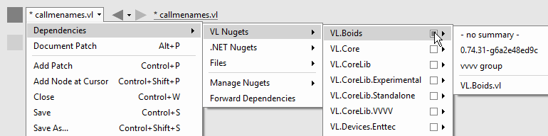
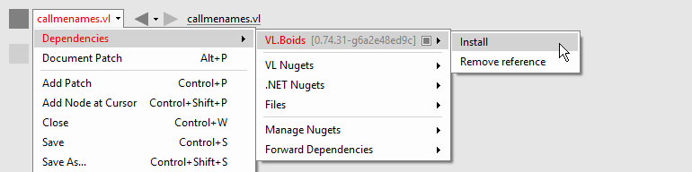
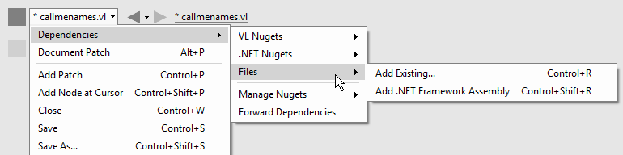
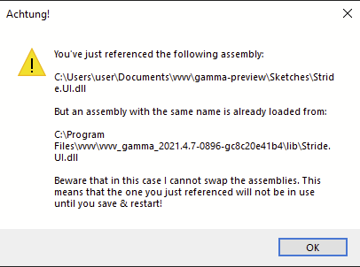

# Referencing Libraries

VL Documents can reference 3 different types of dependencies:

* VL Nugets
* .NET Nugets
* Files

When a document references a dependency, it means that all public nodes in that dependency will be available to it via the [NodeBrowser](../hde/the_nodebrowser.md).

## Nugets
[NuGet](https://www.nuget.org) is the package managing system for .NET. Nugets are packages that can contain many .dll and/or .vl files that expose nodes to the referencing document.

For installing nugets, see [Managing Nugets](../hde/managing-nugets.md).

### VL vs. .NET Nugets
A VL Nuget is a nuget specifically created for use with vl that won't work for any other [.NET language](https://en.wikipedia.org/wiki/List_of_CLI_languages). It is still a valid nuget in the original terms of NuGet but since it contains .vl documents it will not be useable outside of vl.

A .NET Nuget on the other hand is more generally targetting any .NET language.

You can reference either VL or .NET nugets via the menu by navigating to it and pressing the right mousebutton to toggle its selection:

Rightclick toggles adding/removing a nuget reference

### Missing Nugets
If a nuget that is referenced by a document cannot be found,  it will be listed in red in the Dependencies menu. In such a case a rightclick on a red entry allows you to:

* *Install*: attempt to install from nuget.org. This will obviously only work if the nuget can be found online
* *Remove Reference*: remove this nuget as a dependency of this document

Note that you can rightlclick to select multiple red entries and then choose to apply either install or remove to all of them at once.

Missing nuget options

### Unmanaged/Native dependencies
Some nugets are shipping with or depending on unmanaged/native .dlls which cannot be picked up by vl automatically since there isn't a pattern in the nuget specification as to how those should be handled. So in order to get such unmanaged dependencies of a nuget picked up, for now you'll have to add a search-path for vl via a batch file, like so:

    SET PATH=%PATH%;c:\path\to\nugets\nativelibs;
    vvvv.exe

## Files
A vl document can reference other .vl documents and managed .dll files.

### From Disk
Here are 3 ways to reference local files:

* Press <kbd>Ctrl</kbd><kbd>Shift</kbd><kbd>E</kbd> to select files via a file browser
* Via `Document > Dependencies > Files > Add Existing...`
* Via `Document > Dependencies > Files > Add New`

Add existing File as dependency

#### Missing Files
Files that are showing up in red cannot be found on disk. You can rightclick to remove or replace their reference. 

#### Removing or Replacing Files
You can rightclick a file reference to remove or replace it. Note that you can also rightclick to select multiple files in a row and then apply "Remove" to all of them at once.

Remove files

#### Duplicate reference warning

When referencing a .dll you may encounter a warning similar to the following warning:

The warning pops up because a file with the same name is already loaded by vvvv. 

There are two situations in which this may occur:
1) Changing the location from which to load a .dll:  
You've set a reference to the .dll before but have since moved it to a different location on disk and now want to fix the reference to that new position. 

2) Referencing a .dll that vvvv itself has already loaded:  
You're setting a reference to a .dll in one location but a .dll with the same name has already been loaded from another location, most likely by vvvv itself. 

If you are certain that those are actually the same files, only in a different location, then you can ignore the warning. 

Otherwise in case 1) restarting vvvv should help, but in case 2) you'll actually not have a chance to get this solved. .dlls loaded by vvvv cannot be changed at all. If for some reason you need to use a newer version of a .dll than the one vvvv is currently using, please start a thread on the [forum](https://forum.vvvv.org) about this and we'll see what we can do. 

### Libraries from the GAC (Global Assembly Cache)

By default .NET comes with a large number of assemblies that can be referenced. They are stored in the [GAC](https://docs.microsoft.com/en-us/dotnet/framework/app-domains/gac) on all machines that have .NET installed and can be referenced from there via:

* Press <kbd>Ctrl</kbd><kbd>Alt</kbd><kbd>E</kbd>
* via `Document > Dependencies > Files > Add .NET Framework Assembly...`

In the dialog you need to double-click entries that you want to add as references.

Use <kbd>Ctrl</kbd><kbd>F</kbd> in this window to find libraries in the GAC

